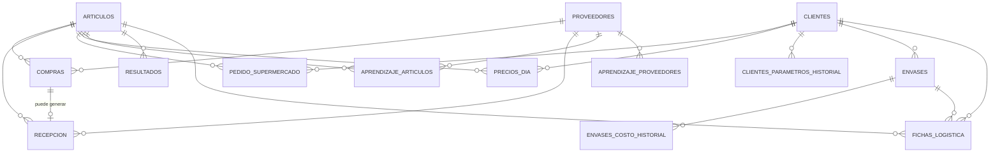

# Diseño de base de datos — Calculador de Precios

Este documento resume el diseño de tablas acordado antes de escribir el
código de la base de datos. Es un documento de referencia: si algo cambia
en el negocio, primero se actualiza acá y después el código.

## Ideas generales

- Casi todo se agrupa por **fecha de operación** (el día al que pertenece
  cada dato, no necesariamente el día en que se cargó).
- La **Recepción** nunca queda cerrada de forma definitiva: Administración
  puede darle un OK, pero eso no impide corregirla después.
- Cuando algo llega tarde (una recepción, un precio, un pedido corregido),
  el **Resultado** de ese día se puede recalcular.
- Los **parámetros del negocio** (descuento, utilidad, costos de envase, kg
  por palet) son editables y guardan historial: un cambio de hoy no debe
  mover los resultados de días pasados.

---

## 1. Artículos

Las fichas de logística de cada producto (hoy en `core/fichas.py`), pero
editables desde la app en vez de fijas en el código.

| Campo | Descripción |
|---|---|
| id | identificador interno |
| nombre | único, editable (ej. "Tomate Redondo") |
| código_interno | código propio del artículo, para no confundirlo con otro aunque cambie el nombre |
| cubetas_por_caja | solo si el cajón del productor viene subdividido en cubetas; dato de recepción |
| unidades_por_cajón / kg_por_cajón | solo para artículos que se pesan por palet (Mango, Palta); dato de recepción, no de reparto a un cliente |
| merma_porcentaje | porcentaje de merma esperado del artículo (0 = sin merma) |
| activo | para dar de baja un artículo sin borrar su historial |

> **Nota:** ni `tipo_envase`/`contenido_caja` NI `unidad_venta` viven acá.
> El mismo artículo puede repartirse en un envase distinto y venderse en
> una unidad distinta según el cliente (ej. Mango: un cliente lo compra
> por unidad, otro por kilo) — los tres campos viven en **Fichas de
> logística por cliente** (punto 12). Acá solo queda lo que es intrínseco
> al producto en sí: cómo llega el cajón del productor al depósito, sin
> importar a qué cliente se le venda ni en qué unidad se le facture.

## 2. Proveedores

| Campo | Descripción |
|---|---|
| id | identificador interno |
| nave | — |
| puesto | — |
| nombre | editable; la última corrección pisa la anterior, sin historial |

La llave real es **nave + puesto**. El nombre es solo un dato descriptivo
que puede corregirse sin cambiar la identidad del proveedor.

## 3. Compras

Cada renglón que carga el comprador.

| Campo | Descripción |
|---|---|
| id | — |
| fecha_operación | día al que pertenece la compra |
| artículo | referencia a Artículos |
| proveedor | referencia a Proveedores |
| cantidad_kilos | dato crudo: cuántos kilos se compraron (opcional si se cargó en fracción) |
| cantidad_fraccion | dato crudo: cuánta "fracción" (unidad o cubeta, según el artículo) se compró (opcional si se cargó en kilos) |
| importe | — |
| seña | opcional, por artículo (no por toda la compra) |
| tipo_retiro | Clark / Carro / Pases (default Clark) |
| palets | — |
| cargado_el | fecha y hora de carga, para auditoría |

Se cargan los **dos datos crudos** de la misma compra cuando aplica (ej.
Mango: 10 unidades, 4 kg) — no un factor de conversión entre kilos y
fracción. `cantidad_fraccion` es un nombre genérico a propósito: significa
"unidad" o "cubeta" según el artículo, pero nunca las dos cosas a la vez
(un artículo que se vende por cubeta jamás se vende por unidad, y
viceversa), así que una sola columna alcanza. De ahí el motor de costeo
deriva costo por kilo (`importe / cantidad_kilos`) y costo por fracción
(`importe / cantidad_fraccion`); qué versión usar la decide la
`unidad_venta` de la ficha de logística del cliente correspondiente (si es
"kilo" usa `cantidad_kilos`; si es "unidad" o "cubeta" usa
`cantidad_fraccion`). Al menos uno de los dos campos tiene que estar
cargado.

Varias compras del mismo día/artículo/proveedor son las que el motor de
costeo promedia ponderando por cantidad.

> **Nota (varios clientes):** el costo de compra queda único, sin distinción
> de cliente. No tiene cliente_id: se compra igual sin importar a qué
> cliente se le vaya a vender después.

## 4. Recepción

Lo que realmente entra al depósito; puede no coincidir con lo comprado.

| Campo | Descripción |
|---|---|
| id | — |
| fecha_operación | — |
| compra | referencia a la Compra correspondiente (vacío si es un agregado fuera de horario sin compra cargada) |
| artículo / proveedor | por si no hay compra vinculada |
| cantidad_recibida | — |
| kilaje_recibido | — |
| es_agregado_fuera_de_horario | sí/no |
| aprobado_por_administración | sí/no — no bloquea la edición, solo indica que fue revisada |
| actualizado_el | para saber cuándo se tocó por última vez y disparar un recálculo |

## 5. Pedido del supermercado

Llega por mail al mediodía, dividido en tres depósitos.

| Campo | Descripción |
|---|---|
| id | — |
| fecha_operación | — |
| cliente | a qué cliente corresponde el pedido |
| sucursal | VL / BZ / GR |
| artículo | — |
| cantidad | ya sumada dentro de esa sucursal si el mail repite el artículo |
| recibido_el | hora de llegada del mail |

Se guarda el desglose por depósito (no solo el total) porque a futuro sirve
para estadísticas por depósito y artículo — por ejemplo, una tabla de
**Rechazos** (mercadería que el supermercado no recibe por calidad) con la
misma forma: fecha + sucursal + artículo + cantidad + motivo. Para el
costeo en sí, se usa la suma de las tres sucursales por artículo.

## 6. Precios del día

Los precios negociados con el supermercado.

| Campo | Descripción |
|---|---|
| id | — |
| fecha_operación | — |
| cliente | a qué cliente corresponde el precio negociado |
| artículo | — |
| precio | — |

Un precio por artículo, por día y por cliente, sin distinción de sucursal
(el mismo precio aplica a los tres depósitos de un mismo cliente). Puede
cambiar de un día a otro sin riesgo de confusión porque cada artículo tiene
su código propio y estable.

## 7. Aprendizaje (memoria de abreviaturas)

Dos listas separadas, porque resuelven cosas distintas:

### 7a. Aprendizaje de artículos

| Campo | Descripción |
|---|---|
| proveedor | de quién es la comanda |
| texto_leído | ej. "Tom R" |
| artículo | a qué artículo corresponde (ej. "Tomate Redondo") |

### 7b. Aprendizaje de proveedores

| Campo | Descripción |
|---|---|
| texto_leído | ej. membrete o firma de la comanda |
| proveedor | a qué proveedor corresponde |

Estas listas crecen con el tiempo y complementan las reglas fijas que ya
están en el prompt de `lector_comandas.py` (como "M rojo = Morrón Rojo").

## 8. Parámetros del negocio

Guarda lo que sigue siendo **genuinamente global** (no depende del
cliente), con historial de cambios. Por ahora, el único parámetro acá es
`kg_por_palet`.

`descuento_estandar`, `utilidad_estandar`, `costo_envase_chico` y
`costo_envase_grande` **ya no viven acá**: el descuento y la utilidad
ahora son por cliente (ver punto 10), y el costo de envase vive en cada
Envase (ver punto 11).

| Campo | Descripción |
|---|---|
| nombre_parámetro | ej. "kg_por_palet" |
| valor | — |
| vigente_desde | fecha a partir de la cual rige este valor |

Al calcular o recalcular el resultado de una fecha puntual, se usa el valor
que estaba vigente **en esa fecha** (no el de hoy). Un cambio nuevo solo
afecta desde su fecha en adelante; los días pasados no se mueven.

## 9. Resultados (calculado)

No es un dato que carga alguien a mano: es la salida del motor de costeo
(costo ponderado, precio sugerido, utilidad real, cantidad de cajas,
palets) guardada por día y artículo, para no recalcular todo desde cero
cada vez que se abre una pantalla. Cuando llega una recepción tardía o se
corrige un precio o un pedido, este registro se vuelve a calcular.

| Campo | Descripción |
|---|---|
| fecha_operación | — |
| artículo | — |
| costo_ponderado | — |
| precio_sugerido | — |
| utilidad_real | — |
| cantidad_cajas / palets | — |
| recalculado_el | última vez que se recalculó |

## 10. Clientes

Antes el sistema asumía un solo cliente implícito (el supermercado "Día"),
con un descuento y una utilidad únicos y globales. Ahora cada cliente tiene
los suyos propios, con historial de vigencia (mismo criterio que
Parámetros del negocio: un cambio de hoy no mueve los días pasados).

| Campo | Descripción |
|---|---|
| id | — |
| nombre | único (ej. "Día") |
| activo | para dar de baja un cliente sin borrar su historial |

**Historial de descuento y utilidad por cliente:**

| Campo | Descripción |
|---|---|
| cliente | — |
| nombre_parámetro | 'descuento' o 'utilidad_objetivo' |
| valor | — |
| vigente_desde | fecha a partir de la cual rige este valor |

## 11. Envases

Antes el costo de envase (chico/grande) era único y global. Ahora cada
cliente tiene sus propios envases, cada uno con su propio costo con
historial.

| Campo | Descripción |
|---|---|
| id | — |
| cliente | dueño de este envase |
| nombre | ej. "Caja Chica Día" |
| activo | — |

**Historial de costo del envase:**

| Campo | Descripción |
|---|---|
| envase | — |
| costo | — |
| vigente_desde | fecha a partir de la cual rige este costo |

## 12. Fichas de logística por cliente

**Única fuente de verdad** de en qué unidad se vende cada artículo para
cada cliente, qué envase usa, y cuánto contenido trae la caja en ese caso
puntual. Reemplaza a los campos `tipo_envase`/`contenido_caja`/
`unidad_venta` que antes vivían (únicos, sin distinción de cliente) en
Artículos. El mismo artículo puede tener `unidad_venta` distinta según el
cliente (ej. Mango: un cliente lo compra por unidad, otro por kilo).

| Campo | Descripción |
|---|---|
| id | — |
| artículo | — |
| cliente | — |
| unidad_venta | kilo / unidad / cubeta, para este artículo + cliente |
| envase | vacío si no usa un envase compartido (se entrega en su propio cajón) |
| contenido_caja | cuánto trae la caja para este artículo + cliente (vacío si no usa envase compartido) |

---

## Relaciones



Artículos, Proveedores y Clientes son los catálogos de donde cuelga todo lo
demás. Compras, Recepción, Pedido del supermercado y Precios del día
apuntan a un artículo (y las que corresponde, a un proveedor y/o cliente),
agrupados por fecha_operación. Aprendizaje conecta texto crudo con
artículos/proveedores. Parámetros y Resultados no dependen de nada:
Parámetros alimenta el cálculo, y Resultados es la salida. Clientes tiene
su propio historial de descuento/utilidad y sus propios Envases (con su
propio historial de costo); Fichas de logística conecta un Artículo con un
Cliente y el Envase que usa.

## Para retomar (anotado el 29/08/2026, antes del corte)

Se corta acá a propósito. **Quedan desplegadas E0 (parcial), E1, E2, E3 y
E5.** El lunes 31/08 arranca el modelo nuevo y se lo mira funcionar unos
días antes de seguir tocando: acumular cambios sin ver ninguno andando en
la operación real es cómo se llega a no poder distinguir qué rompió qué.
El domingo se carga el stock inicial a mano.

En orden, para el martes o miércoles:

1. **E4 — el FIFO que no viaja al futuro.** Va **sola y primera** (decisión
   del dueño el 31/08): mueve costos, y con otros cambios encima no se
   distingue el arreglo del ruido. Toca `atribuir_costos_fifo`
   (`core/costo_real.py`) y `repartir_fifo` (`core/stock.py`). No cambia
   ninguna pantalla. Sin migración.
   **Antes de tocar `repartir_fifo` hay que contestar la pregunta de la
   fecha del reproceso** — ver "las guías R atrasadas quedan fechadas
   después de las salidas que explican", más abajo. Y al leer los costos de
   la primera semana, tener presente el arrastre del lunes que esa misma
   sección describe: va a parecer que E4 quedó mal y no va a ser E4.

2. **Elegir del stock que hay** — el lote de tres piezas que ya se perdió del
   plan tres veces: el **freno por stock del reproceso**, su **desglose
   editable**, y **la misma elección en el armado de pedido** (que E5 dejó con
   los dos avisos y sin la elección). Las tres van juntas y **después de E4**,
   porque las tres necesitan lo mismo: saber qué había en cada lote a una
   fecha. En el reproceso la edición viene con freno —ahí se congela un costo
   que no se corrige nunca—; en el armado **avisa y no traba**, igual que hoy.
   Todo el detalle en "Pendiente con nombre propio: elegir del stock que hay",
   más abajo.

3. **E6 — las alertas.** Se puede hacer en cualquier momento, no depende
   de que haya datos. Cuenta **solo los reprocesos posteriores al
   31/08/2026**: si contara todos, Frutamax nacería con 36 casos que
   nadie puede resolver, y una alerta que arranca en rojo permanente se
   deja de mirar. Incluye la advertencia en Gerencia con el número de
   bultos sin costear.

4. **El retenido de Stock Físico**, en la rama
   `claude/retenido-stock-fisico` (commit `597896e`): "buscar los conteos
   de un día". **Tiene cruce con E3**, que reescribió esa misma pantalla
   —el artículo pasó a vivir en la URL y se agregó el campo "Qué
   contaste"—, así que no se aplica tal cual: hay que rehacer la búsqueda
   por día sobre la pantalla nueva.

5. **La lentitud de Frutamax**, que sigue sin diagnosticar. Lo medido: el
   costo está en **abrir la conexión**, no en la consulta — las dos
   pantallas que se sienten normales (`/gerencia` y `/`) son las únicas
   con cero conexiones, y la base no muestra nada corriendo. Hipótesis
   principal sin verificar: comparar los dos `DATABASE_URL` en Railway
   (directo contra pooler; timeouts de fallback IPv6). Los tres SQL de
   comparación de volumen, índices y conexiones siguen sin correr.

6. **Reescribir los scripts del corte sin temporales, y correr el verificador
   que nunca corrió** (`db/corte_frutamax_*`). El corte se aplicó, pero el
   script **falló en el editor de Supabase y escribió igual**: ahí
   `begin ... commit` no es atómico y las tablas y vistas temporales no
   sobreviven de una sentencia a la siguiente. Terminó bien por casualidad.
   **El verificador de las 12 nunca se corrió** —tiene el mismo defecto—, así
   que el corte se respaldó con dos consultas de una sola sentencia armadas a
   mano: stock por artículo contra la foto con las seis patas, los cuatro
   conteos, y la plata. **Quedaron sin verificar las verificaciones 04, 05, 11
   y 12**: sueltos negativos (el síntoma de las cajas fantasma), cajas por
   ficha, que el FIFO arranque limpio, y que ningún lote con resto haya
   quedado sin precio. Reescrito el verificador, **se corre en Frutamax para
   cerrar ese hueco**, aunque sea después del arranque. Los dos archivos
   quedaron con un cartel de "no reusar" arriba y **hay que reescribirlos
   antes del corte de Palmala**, que sigue pendiente. La regla que sale de acá
   está en `CLAUDE.md`. El incidente completo, en `db/APLICADO.md`.

7. **La etiqueta de `cierre_modelo_viejo`** en `ETIQUETAS_MOVIMIENTO_STOCK`
   (`app/main.py`). Hoy el tipo nuevo se ve como texto crudo en Movimientos
   de Stock. No rompe nada (el `.get()` tiene fallback), es solo feo. Sin
   urgencia y sin migración.

## El plan del modelo nuevo (E0–E6)

Aprobado el 28/08/2026 **con el orden tal cual**, y anotado acá el
29/08 porque hasta entonces solo vivía en el chat: se perdió una vez y
frenó el arranque de una etapa. El orden no es de conveniencia, es de
dependencia — cada una necesita que la anterior exista.

| # | Qué | Estado |
|---|-----|--------|
| **E0** | Rename Facturación → Administración + reordenamiento de navegación | Fases 1 y 2 y el "resto" (los botones de atrás) **en main**. **Fase 3 diferida**: partir `/deposito/pedido`. |
| **E1** | `ficha_id` en `reprocesos` + "sin asignar" explícito | **En main** |
| **E2** | Fecha de corte (31/08/2026) y stock inicial con tipo propio | **En main** |
| **E3** | `conteos_stock` con `ficha_id`; Stock Físico y Cotejo por porción | **En main** |
| **E4** | El FIFO que nunca consume un lote posterior a la salida | Pendiente, **a propósito después del lunes**. De ella cuelgan las tres piezas de "elegir del stock que hay": el freno por stock, el desglose editable del reproceso y el del armado de pedido. Sin E4, trabar rompe la carga con demora y el desglose que se muestre estaría mal (ver la sección, más arriba) |
| **E5** | El pedido descuenta del formato de la ficha, no del artículo, con la tolerancia | En curso |
| **E6** | Alerta de reprocesos sin asignar + advertencia en Gerencia | Pendiente |

**E1 es la piedra angular** y por eso va primera: sin saber a qué ficha
fueron las cajas de una guía R no existe el número contra el cual
comparar, y E3 no se puede hacer.

**E4 va después del lunes a propósito.** Toca `atribuir_costos_fifo`
(`core/costo_real.py`) y `repartir_fifo` (`core/stock.py`) para que el
FIFO nunca consuma un lote posterior a la salida. Eso **mueve números**,
y con datos viejos adentro no se puede distinguir el arreglo de la
basura previa: haría falta decidir si un cambio es la corrección o el
ruido de lo que ya estaba mal. Con el corte pasado, cualquier cambio que
se vea es el arreglo. No necesita migración.

**E6** cuenta **solo los reprocesos posteriores al 31/08/2026**. Si
contara todos, Frutamax nacería con 36 casos que nadie puede resolver, y
una alerta que arranca en rojo permanente es una alerta que se deja de
mirar. Incluye la advertencia en Gerencia con el número de bultos sin
costear.

**Lo que NO es una etapa:** la ventana de 10 días (diez días y dentro
del mes en curso) pertenece a la **carga retroactiva en
Administración**, que todavía no está asignada a ninguna etapa.

## Pendiente con nombre propio: elegir del stock que hay (freno + desglose del reproceso + armado de pedido)

Relevado el 29/08/2026, después de que una guía R real tomara 300 bultos
de un artículo que no los tenía.

**Por qué se perdió**: el plan E0–E6 se armó sobre tablas y pantallas, y
estas dos piezas no son ni una cosa ni la otra. E1 agregó `ficha_id` a
`reprocesos`, pero ninguna etapa dijo "el reproceso toma lotes reales".
Quedó afuera de todas.

### El reproceso es la excepción a "avisa, no traba"

En todo el sistema la regla es avisar y no trabar: el conteo físico es
declarativo, el armado de pedido avisa por tolerancia y por falta de
cajas, la merma no se discute. El piso es la verdad.

**El reproceso es distinto, y por una razón concreta: es el único acto
del operario que CONSUME LOTES Y CONGELA COSTO.** Los demás declaran un
hecho que se corrige solo —el próximo conteo pisa al anterior, un renglón
se destilda— o registran una salida que realmente ocurrió. El reproceso,
en cambio, escribe `reprocesos_consumos` con el costo de cada lote
congelado en ese instante, y ese costo es el que después alimenta el
costo de la primera, la rentabilidad real y el precio de las cajas que
salgan de ahí. Un número tomado de más no queda como una diferencia a la
vista: queda como un consumo `sin_lote` sin precio posible, que deja la
guía con costo incompleto **para siempre** — no hay compra a la que ir a
buscarle el importe, porque esos bultos no existieron.

Por eso acá trabar no contradice el criterio: lo que se protege no es el
stock, es el costo.

### LA REGLA: el reproceso es 100% o nada

**El reproceso se hace 100% bien o no se hace.** El que puede quedar
suelto es el armado del pedido, no este. Un pedido puede salir con
mercadería que el sistema no tiene y eso se resuelve después; un
reproceso mal cargado congela un costo que no se corrige nunca.

De esa regla salen las dos piezas del reproceso, y van juntas:

1. **Si no hay remanente en el sistema, no se puede cargar. Punto.** No
   es "avisa y sigue", no es `sin_lote`. Se traba.
2. **El operario dice artículo y cantidad, y el sistema le muestra el
   desglose** que armó por FIFO: qué lotes, de qué proveedor, qué
   cantidad de cada uno. Él confirma, o lo modifica **dentro de lo que
   hay de cada lote**. La edición es OPCIONAL: si no quiere mirar nada,
   confirma y listo.

**Esto ya se perdió TRES veces. Que no pase una cuarta.**

- La primera, del plan E0–E6: se armó sobre tablas y pantallas, y esto no
  es ni una cosa ni la otra. E1 agregó `ficha_id` a `reprocesos`, pero
  ninguna etapa dijo "el reproceso toma lotes reales".
- La segunda, el 29/08: se sacó el desglose editable del alcance por
  considerarlo "revertir una decisión". Era al revés — la decisión que
  había que revertir era justamente esa.
- Y la misma pieza en el **armado de pedido** se perdió sin que nadie la
  nombrara: estaba definida en la conversación de diseño y E5 salió con los
  dos avisos y sin la elección. No se discutió sacarla; simplemente no entró.

### La tercera pieza: el armado de pedido tampoco deja elegir del stock

Anotado el 29/08/2026. **Es la misma pieza aplicada a la otra pantalla**, y
también quedó definida en la conversación de diseño y nunca se implementó:
**E5 dejó solo los dos avisos** (la tolerancia de kilos y el de "no hay cajas
de esta ficha"), no la elección.

Hoy el que arma un pedido tilda un renglón y el sistema descuenta del stock
del artículo sin decir de dónde. **Tiene que ser lo mismo que el reproceso:
default por FIFO, edición OPCIONAL dentro de lo que hay.** El que arma dice
artículo y cantidad; el sistema propone de qué lotes sale; él confirma, o lo
corrige dentro del remanente de cada lote.

**La diferencia con el reproceso es el freno, y sigue en pie:** el armado
**avisa y no traba**. Un pedido puede salir con mercadería que el sistema no
tiene —el piso es la verdad, el camión sale igual— y el sobrante cae a
`sin_lote` como hoy. Lo que cambia no es si se puede armar, sino que el que
arma pueda **decir de dónde salió** en vez de que lo adivine el FIFO a
posteriori. En el reproceso la misma edición viene con freno porque ahí se
congela un costo que no se corrige nunca; acá no.

**Va en el MISMO LOTE que el desglose del reproceso, después de E4**, y por la
misma razón: las dos piezas necesitan saber **qué había en cada lote a una
fecha**, y eso es exactamente lo que E4 deja listo. Antes de E4, el desglose
que se le muestre al que arma un pedido cargado con demora estaría mal por la
misma causa que rompería el freno.

### DECIDIDO (01/09): contra qué número compara el freno

**Contra la SUMA DE LOS RESTANTES DE LOS LOTES, no contra el neto.**

Ese número **nunca puede ser negativo**: los restantes son ≥ 0 por
construcción, y el negativo del neto vive en `sin_lote`, que es otra cosa. Con
eso la pregunta "¿qué pasa cuando el stock a esa fecha ya viene negativo?" no
llega a plantearse — el freno no mira ese número. Era la objeción del dueño y
es la que forzó este diseño: trabar a un operario por un agujero que ya estaba
ahí antes de que tocara nada sería trabarlo por lo mismo que está arreglando.

**El recorte es asimétrico, a propósito: entradas HASTA la fecha inclusive,
salidas HASTA EL DÍA ANTERIOR.** Las salidas del mismo día no cuentan.

Sale de la regla que E4 ya fijó: **dentro de un día el sistema no tiene
orden** — guarda fechas, no horas. Descontar una salida del mismo día es
afirmar un orden que no sabemos, y afirmarlo justo en contra del que está
reprocesando. Es la misma simetría que ya aceptamos del otro lado: un lote
cargado a la tarde cubre una salida de esa misma mañana.

Medido con el código, sobre el caso real del 31/08 (Zapallito: 44 sueltos + 25
cajas del corte, y el depósito arma 69 cajas ese mismo día antes de cargar la
guía R). El operario carga después la guía que falta, tomando 44:

```
neto al cierre del día        disponible =  0   ->  LO TRABA
salidas del día no cuentan    disponible = 69   ->  PASA
```

**Y no es un colador.** Los dos casos de inconsistencia real siguen trabados:

```
toma 20 con fecha 03/08 y ese día solo había 5 comprados       -> TRABA
comprado el 20/08, salió entero el 25/08, reproceso del 31/08  -> TRABA
```

### Lo que el freno NO cubre, y qué hacer cuando pase

**Si el reproceso es de un día y las cajas salieron el día ANTERIOR, se
traba.** Es correcto —la mercadería salió antes de existir— pero le va a pasar
al depósito cada vez que arme después de medianoche o cargue la fecha corrida
un día.

**Si el contador de excepciones se llena de esos casos, la respuesta NO es
aflojar el freno: es que la fecha del reproceso está mal cargada**, y para eso
está la ventana retroactiva que se decidió el 31/08. Queda escrito acá para que
la primera racha de excepciones no se lea como "el freno molesta".

### Las tres objeciones, y por qué ninguna alcanza para recortarlo

**La regla de operario.** El desglose son números del sistema, sí. Pero
acá el operario los necesita **para hacer bien su trabajo**, no para
transcribirlos en un conteo. La regla existe para que no arme contra el
sistema en vez de contra el piso: en el reproceso **el piso ya lo declaró
él** (dijo cuántos cajones toma), y lo que ve después es de dónde sale el
costo. Si eso obliga a que Reproceso deje de tratarse como pantalla
ciega, que deje de serlo.

**"Nadie elige lote — lo reparte el sistema"**, en el docstring de
`crear_reproceso` y en la pantalla de Stock por Guía: **eso es lo que hay
que cambiar**, junto con el texto. No es una restricción de diseño a
respetar; es lo que se está corrigiendo.

**La concurrencia** entre el preview y el guardado: es real, y se
resuelve revalidando en el server al escribir y devolviendo una propuesta
fresca si algo cambió. Es trabajo, no un impedimento.

### El orden: E4 primero, y esto sí es un bloqueo técnico

**El freno no se implementa hasta que el FIFO respete la fecha de la
operación**, y eso es la **etapa 4**. No es una preferencia:
`_entradas_y_salidas_stock` usa el estado ACTUAL sin filtro de fecha, y
la pantalla acepta cargar con `fecha_operacion` pasada. Un reproceso de
ayer cargado hoy, cuyas cajas ya salieron en pedidos, chocaría contra una
pared. **Cargar con demora es normal en el depósito**: el freno sin E4
rompe la operación en vez de protegerla.

**Lo que E4 tiene que dejar listo** (relevado el 29/08): hoy conviven DOS
FIFO. El del COSTO (`salidas_stock_articulos` + `atribuir_costos_fifo`)
ya trabaja con **cada salida individual, fechada, tipada y en orden
cronológico** — incluido `reproceso_toma`. El del STOCK
(`_entradas_y_salidas_stock_varios` + `repartir_fifo`) usa **un total sin
fecha**: `salidas_para_reparto` arma una sola salida con `orden: 0`. E4
es hacer que el del stock use las salidas fechadas que el del costo ya
tiene, y que un lote no pueda ser consumido por una salida ANTERIOR a su
propia fecha.

Con eso, el freno pregunta lo único que necesita: **qué quedaba en cada
lote a la fecha del reproceso**.

### Otro argumento para el freno: hay costos que NO se pueden completar nunca

Relevado el 29/08 al investigar el botón **"Completar costo"** de Guías R.

Ese botón rellena `reprocesos_consumos.costo_por_bulto` con el
`compras.importe` del lote del que salió cada consumo — solo donde está
en NULL, sin pisar nunca un costo congelado. Sirve para el caso real: se
reprocesó a la tarde consumiendo la compra de la mañana, que todavía no
tenía precio; cuando el precio se carga, el botón cierra el costo.

**Pero un consumo `sin_lote` tiene `compra_id` en NULL.** No salió de
ninguna compra —son bultos que no existían— así que el `UPDATE` nunca lo
alcanza. Ese botón **no puede completar un `sin_lote`, ni hoy ni nunca**,
y mientras quede uno la guía se queda con `costo_total` en NULL para
siempre.

Verificado contra la base: con el precio de la compra cargado, el botón
completa ese consumo y deja el `sin_lote` intacto; `costo_total` no se
cierra.

Es decir: **hoy el sistema deja crear una guía cuyo costo no se puede
completar nunca, ni a mano ni automáticamente.** No es que falte una
pantalla para arreglarlo — no hay nada que arreglar, el dato no existe.
La única forma de que ese caso no aparezca es que la guía no se pueda
crear, que es exactamente el freno.

### Lo que el freno NO resuelve, aunque se implemente bien

**Trabar es una foto, no una garantía.** Los consumos se congelan al
cargar, pero los lotes que consumieron se pueden corregir después — una
recepción editada a la baja, por ejemplo. Una guía que pasó el chequeo
puede quedar sobreconsumida igual.

No invalida el freno: tapa la puerta de entrada, que es por donde entran
los casos que se vieron. Está escrito para no creer que resuelve más de
lo que resuelve. Cerrar ese agujero (revalidar los consumos cuando cambia
un lote) es otra cosa y todavía no tiene dueño.

### `sin_lote` no desaparece: se angosta

Son DOS cosas distintas con el mismo nombre, y solo una se apaga al
trabar:

- **El consumo guardado** (`reprocesos_consumos.origen = 'sin_lote'`) lo
  escribe únicamente `crear_reproceso`. Con el freno deja de generarse
  **para las guías nuevas**, pero **sigue existiendo para las viejas** —
  Frutamax ya tiene guías con esos consumos. `completar_costo_reproceso`
  y la pantalla de Guías R tienen que seguir tratándolo.
- **El sobrante calculado** (`repartir_fifo(...)["sin_lote"]`, en
  `core/stock.py`) es el resto de CUALQUIER salida que ningún lote cubre:
  renglones armados, mermas, ajustes negativos. Ese **sigue igual**,
  porque armar un pedido no traba (la etapa 5 avisa y nada más).
  Alimenta "Salidas sin lote" en Stock del Sistema, el cartel de Stock
  por Guía, y el motivo `sin_lote` de la Rentabilidad Real.

O sea: trabar el reproceso lleva `sin_lote` de dos fuentes a una. El
concepto y sus pantallas se quedan.

## Pendiente con nombre propio: las guías R atrasadas quedan fechadas después de las salidas que explican

Anotado el 31/08/2026, **antes de E4 y antes de mirar los costos de esta
semana**. Se escribe ahora justamente para no confundirlo después con un error
de E4.

### Qué pasa

El lunes 31/08 el depósito armó cajas de varias fichas **antes** de cargar sus
guías R, y el selector de Reproceso escondía esos artículos (ver la Entrega 0).
Con el selector arreglado, esas guías se cargan **con fecha de hoy** — no con
la del día en que la mercadería se procesó de verdad en el galpón.

**E4 ordena el FIFO por la fecha real del hecho.** Con eso, una guía R cargada
tarde queda fechada **después** de las salidas que la explican: el renglón de
pedido salió el lunes, y la primera que lo cubre nace el martes. Un lote no
puede ser consumido por una salida anterior a su fecha — que es exactamente la
regla que E4 viene a imponer— así que esas salidas del lunes van a caer a
`sin_lote` y a quedar sin costear.

### Por qué hay que tenerlo escrito

**Va a parecer que E4 quedó mal, y no va a ser E4.** Es la secuela del arrastre
del lunes: datos cargados fuera de orden, no una regla mal implementada. Sin
esto anotado, la primera lectura de los costos de la semana manda a revisar el
código nuevo en lugar de mirar las fechas de las guías.

Es acotado y no se propaga: solo alcanza a las guías R del arrastre. Una vez
que el depósito vuelva al orden normal —reproceso primero, armado después— el
problema no vuelve a aparecer **por esta causa**.

### DECIDIDO (31/08): la fecha hacia atrás entra, y entra por la ventana retroactiva

**¿Conviene que el operario pueda cargar un reproceso con fecha anterior?
Sí.** Decisión del dueño el 31/08.

El argumento que la decide: **la fecha real ya es la regla en todo el resto
del módulo** — `fecha_operacion` en compras, movimientos y reprocesos está
documentada como "la fecha REAL del hecho, puede no ser la de carga". El
reproceso cargándose siempre con fecha de hoy es la excepción, no al revés. Y
sin esto, **cada atraso ensucia el costeo**: no es un caso raro, es lo que pasa
todas las semanas.

**Por dónde entra: la ventana retroactiva de Administración**, con su "Guardar
igual" y motivo escrito. **NO como campo libre en la pantalla del operario.**
Mismo criterio que la excepción del freno: posible, visible y contable, pero
nunca tan cómoda como el camino normal.

### Lo que la ventana NO resuelve: el documento congelado y el reparto vivo

Una fecha hacia atrás mete un lote **antes** de salidas ya costeadas. Los
consumos de las guías R posteriores están congelados en `reprocesos_consumos` y
**no se recalculan nunca**. Queda el documento diciendo una cosa y el reparto
vivo diciendo otra. Relevado en el código el 31/08:

**1. Qué tan grave es, y si se ve.**

**La plata NO diverge.** `reprocesos.costo_total` y `costo_por_bulto_primera`
quedan congelados al cargar, y el FIFO vivo usa `rp.costo_por_bulto_primera`
como costo del lote de primera. O sea que **todo lo que está río abajo de una
guía R usa el número congelado**: un lote retroactivo insertado antes no mueve
ni un peso ya informado.

Lo que diverge es **la trazabilidad**: de qué lote dice la guía R que salió cada
bulto. Y es **silenciosa por construcción**, porque las dos versiones no se
cruzan en ninguna pantalla:

- El documento congelado se lee en **un solo lugar**:
  `listar_reprocesos_con_consumos` → la pantalla de Guías R.
- El reparto vivo lo usan Stock del Sistema, Stock por Guía, el selector de lote
  de la merma dirigida y la alerta de cruce de cliente.
- **Nadie los muestra juntos**, así que nadie ve la contradicción. Se puede
  llegar a que Stock por Guía muestre una compra con resto que el documento de
  la guía R dice haber consumido.

**Lo único que sí se mueve solo** es la **alerta de cruce de cliente**: se
recalcula viva en cada carga de pantalla, así que puede empezar o dejar de
aparecer cuando entra un lote retroactivo. No es plata, es una alerta.

**2. Sí conviene avisar, con el molde que ya existe.**

El mismo patrón de dos toques de las señas: `contar_senas_afectadas_por_valor`
cuenta ANTES de escribir nada, la pantalla muestra el número y pide el segundo
toque. Acá el equivalente es contar **las guías R no anuladas del MISMO
artículo con `fecha_operacion` igual o posterior a la fecha nueva**: son las
únicas cuyo reparto podría dejar de coincidir. Es un `count(*)`, sin rejugar
ningún FIFO.

El texto tiene que decir las dos cosas, porque la segunda es la que evita el
susto: *"Hay N guías R de este artículo con fecha igual o posterior. Su reparto
por lote puede dejar de coincidir con el vivo. **Su costo no cambia.**"*

**3. Recalcular es una lata que NO conviene abrir. Y no hace falta.**

Tres razones, en orden de peso:

- **Ya está decidido, y para este mismo caso.** El comentario de
  `reprocesos_consumos` dice: *"Documento congelado: si después se corrige una
  recepción, el stock vivo se reacomoda pero esta trazabilidad y su costo no se
  mueven."* Corregir una recepción produce **exactamente** esta divergencia, y
  ya se resolvió a favor de congelar. La fecha retroactiva no abre un problema
  nuevo: hace más frecuente uno que ya está aceptado.
- **Recalcular mueve plata de meses cerrados.** Recalcular los consumos obliga a
  recalcular `costo_total` y `costo_por_bulto_primera`, que es lo que la
  Rentabilidad Real ya informó.
- **Y cascadea.** Una guía R puede consumir la primera de otra guía R a su costo
  congelado. Recalcular la primera cambia el costo de la segunda, y así hacia
  adelante sin final claro.

**Lo que sí vale la pena, en vez de recalcular:** hacer **visible** la
divergencia donde hoy es muda. Comparar el reparto congelado contra el vivo es
solo lectura, no recalcula nada, y convierte una contradicción silenciosa en una
marca en la pantalla de Guías R — "el reparto de esta guía ya no coincide con el
vivo". Registra y delata, jamás traba, que es el criterio de todo el módulo.
**No entra en E4**: se anota acá y se decide cuando el freno y el desglose estén
andando, que es cuando se va a saber si molesta de verdad.

## Pendiente con nombre propio: el reparto congelado y el vivo pueden decir cosas distintas, y nadie lo ve

Anotado el 31/08/2026, al decidir la fecha retroactiva del reproceso.
**Va DESPUÉS del freno y el desglose**, no antes: recién con esos dos andando
se va a saber si esto molesta de verdad o si es un cartel que nadie mira.

### El problema

Los consumos de una guía R se congelan al cargarla (`reprocesos_consumos`) y
**no se recalculan nunca**. Cualquier cosa que cambie el pasado del FIFO —
corregir una recepción, o ahora cargar un reproceso con fecha hacia atrás—
deja el documento congelado diciendo una cosa y el reparto vivo diciendo otra.

**Es silencioso por construcción**, y eso es lo que lo hace un pendiente:

- El congelado se lee en **un solo lugar**: `listar_reprocesos_con_consumos`,
  la pantalla de Guías R.
- El vivo lo usan Stock del Sistema, Stock por Guía, el selector de lote de la
  merma dirigida y la alerta de cruce.
- **Nadie los muestra juntos.** Se puede llegar a que Stock por Guía muestre
  una compra con resto que el documento de la guía R dice haber consumido, y
  que nadie lo vea nunca.

**La plata no diverge** (ver la decisión de la fecha retroactiva, más arriba):
`costo_total` y `costo_por_bulto_primera` quedan congelados y el FIFO vivo usa
ese mismo número como costo del lote de primera. Lo que diverge es la
trazabilidad. Por eso esto no es urgente — y por eso tampoco desaparece solo.

### La salida: mostrarlo, no arreglarlo

**Recalcular está descartado** y el argumento que lo decide ya está escrito:
corregir una recepción produce exactamente esta divergencia, y el propio
comentario de `reprocesos_consumos` dice que *"el stock vivo se reacomoda pero
esta trazabilidad y su costo no se mueven"*. Es una decisión vieja, no una
omisión.

Lo que sí vale la pena es **comparar los dos repartos y marcar la guía cuando
dejan de coincidir**. Es **solo lectura**: rejugar el FIFO vivo del artículo y
contrastarlo contra los consumos guardados, sin escribir nada, sin recalcular
ningún costo. Convierte una contradicción muda en una marca en Guías R — *"el
reparto de esta guía ya no coincide con el vivo"*. Registra y delata, jamás
traba, que es el criterio de todo el módulo.

**Lo que hay que decidir cuando se haga**, y no antes: si la marca alcanza o si
hay que poder ver las dos versiones lado a lado; y si conviene contarlas en una
alerta de Auditoría o dejarlo como marca por guía. Contarlas tiene el riesgo de
siempre: una alerta que arranca con muchos casos que nadie puede resolver se
deja de mirar.

## Observación de diseño (sin dueño ni urgencia): la alerta de cruce de cliente puede aparecer y desaparecer sola

Anotado el 31/08/2026, **antes de que pase**, para que cuando alguien lo reporte
como bug ya esté explicado.

La alerta de **cruce de cliente** —"esta primera se armó para X y el FIFO se la
atribuyó a un pedido de Y"— **no se guarda: se recalcula viva** en cada carga de
pantalla, corriendo `atribuir_costos_fifo` sobre las entradas y salidas del
momento.

Consecuencia: **cualquier cosa que cambie el pasado del FIFO puede hacerla
aparecer o desaparecer sin que nadie haya tocado esa guía.** Una carga
retroactiva de reproceso (habilitada el 31/08) es exactamente eso, y también lo
es corregir una recepción vieja.

**No es plata y no es un error**: es una alerta derivada de un cálculo que
cambió de insumos. Pero va a parecer errática — un cruce que estaba ayer y hoy
no está, sin que nadie haya hecho nada visible— y alguien lo va a reportar como
bug. Cuando pase, la respuesta es ésta, no una investigación.

**Si algún día molesta de verdad**, la salida no es congelar la alerta (sería
guardar un dato derivado, justo lo que el módulo evita a propósito) sino decir
en la pantalla que se calcula al momento. Sin dueño y sin urgencia.

## Pendiente con nombre propio: el sistema no sabe en qué envase vino un bulto

Relevado el 29/08/2026, al intentar implementar la regla del envase de la
etapa 5. **La regla, como se definió, no se puede implementar hoy**, y no
por una columna que falta sino porque el dato nunca se captura.

La regla era: al armar, el envase del bulto tiene que ser el que la ficha
manda — Cherry de 5 kg en un descartable de 7 kg pasa, Pepino de 4 kg en
un torito de 18 kg nunca pasa.

**Qué se encontró:**

1. **`compras` no guarda el envase.** Guarda `contenido_por_cajon` y
   `contenido_por_cajon_real`: **kilos por cajón, no el envase**. Ninguna
   tabla fuera de fichas ata un `envase_id` a una compra, a un lote ni a
   un bulto.

2. **La única inferencia que existe es binaria y no se guarda.** En
   `app/costeo.py`, `_envases_por_unidad_ponderado`: si la ficha es de
   envase variable y el contenido de esa compra es menor o igual al de la
   ficha, cuenta como descartable (cero cajas); si no, como caja chica.
   Eso **no identifica un envase**: decide si sumar el costo de una caja.
   Nunca resuelve a una fila de `envases`, no se persiste, y solo
   distingue dos casos.

3. **Hay dos universos de envases y no están conectados.** `envases` es
   el catálogo de **venta**, el que eligen las fichas: solo `nombre` y
   `activo`, sin capacidad. `tipos_envase_puesto` son los **cajones
   físicos por proveedor del puesto**, que carga la cajera: existen solo
   para el circuito de Vacíos, se cuentan en agregado por proveedor, y
   nunca se atan a una compra. Tampoco tienen capacidad. O sea: el cajón
   físico se cuenta para devolverle vacíos al proveedor, pero jamás queda
   asociado a la compra que vino adentro.

4. **Para `envase_variable`, el envase de la ficha ya está declarado como
   no confiable por diseño.** El comentario de esa columna dice que
   cuando es true el envase de la ficha es "solo referencia/default: se
   decide por compra". Mango y cherry —los casos que motivaron la regla—
   son justamente esos.

**Por qué no alcanza con agregarle capacidad a `envases`.** Chequear la
ficha contra sí misma (que el envase que declara pueda contener el
kilaje que declara) es **higiene del catálogo, no control de salida**: no
mira el bulto real, así que no impide que salga pepino de un torito de
18 kg. Es otra cosa, no una versión más chica de la regla, y no se hizo
pasar por la etapa 5.

**Capturar el envase de verdad es una etapa propia**, con al menos tres
frentes:

- **Dato nuevo en Recepción**: es cuando el depósito ve el cajón físico.
- **Propagación por el FIFO**: los lotes se consumen por artículo, así
  que un bulto armado puede venir de varias compras con envases
  distintos, y hoy el lote no arrastra ningún envase.
- **Decisión sobre el reproceso**: al rearmar, el envase cambia por
  definición, así que el envase del lote de salida no es el de entrada.

Más el backfill de las fichas de envase variable, que hoy no tienen un
envase confiable del cual partir.

**Mientras tanto**, la etapa 5 va sin la regla del envase (ver
"Decisiones confirmadas", punto 9): un descuento entre formatos con
kilaje parecido puede colarse, y se acepta — es muchísimo menos malo que
descontar de cualquier bulto del artículo sin mirar nada, que es lo que
se hacía antes.

## Observación de diseño (sin dueño ni urgencia): el tilde de retiro es un espejo de la recepción

Visto en producción el 29/08/2026. **No es para tocar ahora.**

Al recepcionar una compra en Depósito, si el retiro seguía pendiente el sistema
lo marca solo: `estado_retiro = 'retirado'`, `retiro_origen = 'deposito'` y
`retiro_procesado_el = now()` — **la misma hora que la recepción**.

**Es razonable**: si la mercadería llegó al depósito, obviamente se retiró del
puesto. Nadie va a ir a tildar dos veces lo mismo, y obligar a hacerlo sería
trabajo de más para registrar algo que ya es evidente.

**El costo es que el tilde de retiro deja de ser un control propio.** Pasa a
ser un reflejo de la recepción, y con eso el dato pierde la capacidad de
contestar una pregunta distinta: **mercadería pagada que nunca se retiró del
puesto**. Hoy esa pregunta no se le puede hacer a `retiro_procesado_el`,
porque para las compras recepcionadas siempre dice lo mismo que la recepción.

**Lo único que salva parte del dato es `retiro_origen`**, que distingue
`'deposito'` (el espejo) de `'logistica'` y de los `automatico_*`. O sea que
las filas espejadas están identificadas, y si algún día hace falta el control
de "pagado y nunca retirado", el camino no arranca de cero: arranca de separar
esas filas y decidir qué se hace con ellas. **Pero eso todavía no está
pensado, y no tiene dueño.**

## Decisiones confirmadas

1. **Parámetros con historial**: cada cambio queda registrado con su fecha
   de vigencia; los cálculos de fechas pasadas siempre usan el valor que
   regía en ese momento.
2. **Pedido del supermercado con desglose por depósito**: se guarda una
   fila por sucursal y artículo (no solo el total), pensando en
   estadísticas futuras (por ejemplo, rechazos por depósito).
3. **Precios del día sin distinción de sucursal**: un precio por artículo
   por día, válido para los tres depósitos.

4. **Modelo final de logística por cliente**: `tipo_envase`,
   `contenido_caja` y **`unidad_venta`** se sacaron de Artículos y viven
   solo en Fichas de logística por cliente (punto 12) — el mismo artículo
   puede venderse por kilo para un cliente y por unidad para otro (ej.
   Mango). `cubetas_por_caja` y los datos de palet
   (`unidades_por_cajón`/`kg_por_cajón`) se quedaron en Artículos porque
   describen cómo llega el cajón del productor al depósito, antes de
   repartir nada a ningún cliente, y no varían según a quién se le venda.
5. **Parámetros globales viejos retirados**: `descuento_estandar`,
   `utilidad_estandar`, `costo_envase_chico` y `costo_envase_grande` se
   borraron de `parametros_historial` — ahora el descuento y la utilidad
   son por cliente (punto 10), y el costo de envase vive en cada Envase
   (punto 11). Solo `kg_por_palet` sigue en Parámetros por ser
   genuinamente global.
6. **Compras con dos datos crudos**: en vez de un solo par
   cantidad/unidad, Compras (punto 3) guarda `cantidad_kilos` y
   `cantidad_fraccion` por separado, sin ningún factor de conversión entre
   ambos. `cantidad_fraccion` es genérica: representa "unidad" o "cubeta"
   según el artículo, porque un mismo artículo nunca se vende por las dos
   a la vez. El motor de costeo deriva costo por kilo y costo por fracción
   directamente de estos dos números, y la ficha de logística del cliente
   decide cuál usar.

7. **Fecha de corte y stock inicial** (decisión de diseño, base de todo
   lo que viene):

   El sistema viene funcionando con reglas que dejaban salir pedidos
   contra cualquier mercadería. Los datos anteriores **no son
   confiables y no se van a corregir**. Se define una FECHA DE CORTE a
   partir de la cual rige el modelo nuevo: **lunes 31/08/2026**.

   Lo anterior **no se borra**: queda visible y consultable, pero
   **fuera del alcance del FIFO nuevo y de la rentabilidad real**. El
   motivo no es comodidad: si el FIFO nuevo alcanza movimientos
   cargados con las reglas viejas, va a costear contra lotes que no son
   lo que dicen ser. Un número mal calculado que parece bueno es peor
   que no tener el número.

   El stock existente al momento del corte se carga como **stock
   inicial**, con su costo, y tiene que nacer con **un tipo o motivo
   propio que lo distinga de cualquier otro movimiento**.

   Esto último no es una preferencia estética, es una lección ya
   pagada: los saldos iniciales de Vacíos se cargaron por la pantalla
   de Ajustes y hoy son **indistinguibles de una corrección de
   faltante** — cualquier reporte de mermas que se haga va a sumar esos
   923 cajones de arranque como si se hubieran perdido (ver "Deuda
   pendiente de limpieza", punto 2, en `db/APLICADO.md`). Ahí el tipo
   propio hay que agregarlo después, con los datos ya mezclados. Acá se
   separa desde el día uno, que es cuando sale gratis.

   **Qué había del lado viejo al momento de fijar el corte** (medido el
   28/08/2026, al correr la etapa 1): Frutamax tiene **36 guías R**
   anteriores al corte y Palmala **ninguna**. Esas 36 quedan con su
   ficha en NULL para siempre — no se van a completar. Por eso la
   alerta de reprocesos sin asignar tiene que contar **solo los
   posteriores al 31/08/2026**: si contara todos, nacería con 36 casos
   que nadie puede resolver, y una alerta que arranca en rojo
   permanente es una alerta que se deja de mirar. Palmala, sin
   historia, queda como base de prueba limpia: ahí cualquier NULL
   posterior al corte es un "sin asignar" real.

   **La fecha de corte y la carga inicial son parte del alcance del
   trabajo, no un paso manual que se resuelve después.** Cuando se arme
   el plan, entran adentro: quién carga el stock inicial, con qué
   pantalla, con qué tipo de movimiento, y qué pasa con lo que quede a
   mitad de camino ese día.

8. **Las salidas se atribuyen a la ficha con la que el cliente PIDIÓ**
   (etapa 3, confirmado el 29/08/2026):

   Desde que el Cotejo se parte por ficha hay que decidir a qué ficha
   se le descuentan las cajas que salen. El sistema no tiene registro
   de qué cajas concretas llenaron qué renglón —eso es trabajo del
   FIFO, que corre por artículo— así que lo único que puede usar es la
   ficha del **renglón del pedido**: con la que el cliente pidió.

   Consecuencia: si el cliente pidió Banana Bolivia y se le mandaron
   cajas de Banana Ecuador, la salida se le descuenta a Bolivia igual,
   y el Cotejo muestra **las dos fichas en rojo a la vez** — una de más
   y la otra de menos.

   **Eso queda así a propósito.** Sustituir una ficha por otra es
   excepcional en la operación, así que esos dos renglones no van a ser
   ruido de todos los días: van a ser exactamente la señal de que pasó
   algo raro y hay que mirarlo. Y es la única forma que tiene hoy el
   sistema de mostrar una sustitución, que hasta ahora no se veía en
   ningún lado.

   **Dónde se resuelve de verdad: en la ETAPA 5**, cuando el armado de
   pedido deje declarar qué se está mandando realmente. Ahí la salida
   va a poder atribuirse a la ficha de las cajas que salieron, y no a
   la del pedido, y estos dos renglones dejan de aparecer por una
   sustitución legítima. Hasta entonces, la atribución por el renglón
   es lo correcto y no hay que "arreglarla" antes de tiempo.

9. **La etapa 5 va SIN la regla del envase** (confirmado el 29/08/2026):

   La regla original —que al armar el envase del bulto sea el que la
   ficha manda— **no se puede implementar**: el sistema nunca captura en
   qué envase vino un bulto (ver el pendiente con nombre propio, más
   arriba). Y la alternativa de chequear la ficha contra sí misma es
   higiene del catálogo, no control de salida: no mira el bulto real, así
   que no impide que salga pepino de un torito de 18 kg. Es otra cosa, y
   no se hace pasar por esta etapa.

   La etapa 5 implementa **solo lo que sí se puede hoy**:

   - El pedido descuenta del stock de **la ficha**, no del artículo. Es
     lo grueso, y no depende del envase.
   - La **tolerancia de ±3 kg por BULTO** (no por renglón), comparando el
     kilaje declarado al armar contra el `contenido_caja` de la ficha.
     **Avisa, no traba.**

   **Lo que queda sin cubrir, aceptado a sabiendas**: sin la comparación
   de envase, un descuento entre dos formatos con kilaje parecido se
   puede colar. Se acepta porque es muchísimo menos malo que lo de
   antes, donde el pedido descontaba de cualquier bulto del artículo sin
   mirar nada.
