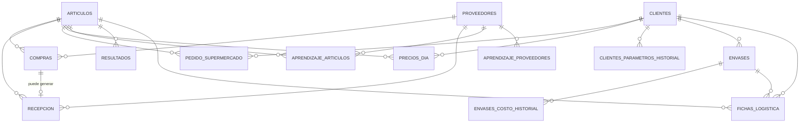

# Diseño de base de datos — Calculador de Precios

Este documento resume el diseño de tablas acordado antes de escribir el
código de la base de datos. Es un documento de referencia: si algo cambia
en el negocio, primero se actualiza acá y después el código.

## Ideas generales

- Casi todo se agrupa por **fecha de operación** (el día al que pertenece
  cada dato, no necesariamente el día en que se cargó).
- La **Recepción** nunca queda cerrada de forma definitiva: Administración
  puede darle un OK, pero eso no impide corregirla después.
- Cuando algo llega tarde (una recepción, un precio, un pedido corregido),
  el **Resultado** de ese día se puede recalcular.
- Los **parámetros del negocio** (descuento, utilidad, costos de envase, kg
  por palet) son editables y guardan historial: un cambio de hoy no debe
  mover los resultados de días pasados.

---

## 1. Artículos

Las fichas de logística de cada producto (hoy en `core/fichas.py`), pero
editables desde la app en vez de fijas en el código.

| Campo | Descripción |
|---|---|
| id | identificador interno |
| nombre | único, editable (ej. "Tomate Redondo") |
| código_interno | código propio del artículo, para no confundirlo con otro aunque cambie el nombre |
| unidad_venta | kilo / unidad / cubeta — intrínseco del producto, no depende del cliente |
| cubetas_por_caja | solo si se vende por cubeta; cómo llega el cajón del productor |
| unidades_por_cajón / kg_por_cajón | solo para artículos que se venden por unidad pero se pesan por palet (Mango, Palta); dato de recepción, no de reparto a un cliente |
| merma_porcentaje | porcentaje de merma esperado del artículo (0 = sin merma) |
| activo | para dar de baja un artículo sin borrar su historial |

> **Nota:** `tipo_envase` y `contenido_caja` NO viven acá — un mismo
> artículo puede repartirse en un envase distinto según el cliente, así que
> esos dos campos viven en **Fichas de logística por cliente** (punto 12).
> Acá solo queda lo que es intrínseco al producto en sí, sin importar a qué
> cliente se le venda.

## 2. Proveedores

| Campo | Descripción |
|---|---|
| id | identificador interno |
| nave | — |
| puesto | — |
| nombre | editable; la última corrección pisa la anterior, sin historial |

La llave real es **nave + puesto**. El nombre es solo un dato descriptivo
que puede corregirse sin cambiar la identidad del proveedor.

## 3. Compras

Cada renglón que carga el comprador.

| Campo | Descripción |
|---|---|
| id | — |
| fecha_operación | día al que pertenece la compra |
| artículo | referencia a Artículos |
| proveedor | referencia a Proveedores |
| cantidad | — |
| unidad | kilo / unidad, tal como se cargó esa vez |
| importe | — |
| seña | opcional, por artículo (no por toda la compra) |
| tipo_retiro | Clark / Granel |
| palets | — |
| cargado_el | fecha y hora de carga, para auditoría |

Varias compras del mismo día/artículo/proveedor son las que el motor de
costeo promedia ponderando por cantidad.

> **Nota (varios clientes):** el costo de compra queda único, sin distinción
> de cliente. No tiene cliente_id: se compra igual sin importar a qué
> cliente se le vaya a vender después.

## 4. Recepción

Lo que realmente entra al depósito; puede no coincidir con lo comprado.

| Campo | Descripción |
|---|---|
| id | — |
| fecha_operación | — |
| compra | referencia a la Compra correspondiente (vacío si es un agregado fuera de horario sin compra cargada) |
| artículo / proveedor | por si no hay compra vinculada |
| cantidad_recibida | — |
| kilaje_recibido | — |
| es_agregado_fuera_de_horario | sí/no |
| aprobado_por_administración | sí/no — no bloquea la edición, solo indica que fue revisada |
| actualizado_el | para saber cuándo se tocó por última vez y disparar un recálculo |

## 5. Pedido del supermercado

Llega por mail al mediodía, dividido en tres depósitos.

| Campo | Descripción |
|---|---|
| id | — |
| fecha_operación | — |
| cliente | a qué cliente corresponde el pedido |
| sucursal | VL / BZ / GR |
| artículo | — |
| cantidad | ya sumada dentro de esa sucursal si el mail repite el artículo |
| recibido_el | hora de llegada del mail |

Se guarda el desglose por depósito (no solo el total) porque a futuro sirve
para estadísticas por depósito y artículo — por ejemplo, una tabla de
**Rechazos** (mercadería que el supermercado no recibe por calidad) con la
misma forma: fecha + sucursal + artículo + cantidad + motivo. Para el
costeo en sí, se usa la suma de las tres sucursales por artículo.

## 6. Precios del día

Los precios negociados con el supermercado.

| Campo | Descripción |
|---|---|
| id | — |
| fecha_operación | — |
| cliente | a qué cliente corresponde el precio negociado |
| artículo | — |
| precio | — |

Un precio por artículo, por día y por cliente, sin distinción de sucursal
(el mismo precio aplica a los tres depósitos de un mismo cliente). Puede
cambiar de un día a otro sin riesgo de confusión porque cada artículo tiene
su código propio y estable.

## 7. Aprendizaje (memoria de abreviaturas)

Dos listas separadas, porque resuelven cosas distintas:

### 7a. Aprendizaje de artículos

| Campo | Descripción |
|---|---|
| proveedor | de quién es la comanda |
| texto_leído | ej. "Tom R" |
| artículo | a qué artículo corresponde (ej. "Tomate Redondo") |

### 7b. Aprendizaje de proveedores

| Campo | Descripción |
|---|---|
| texto_leído | ej. membrete o firma de la comanda |
| proveedor | a qué proveedor corresponde |

Estas listas crecen con el tiempo y complementan las reglas fijas que ya
están en el prompt de `lector_comandas.py` (como "M rojo = Morrón Rojo").

## 8. Parámetros del negocio

Guarda lo que sigue siendo **genuinamente global** (no depende del
cliente), con historial de cambios. Por ahora, el único parámetro acá es
`kg_por_palet`.

`descuento_estandar`, `utilidad_estandar`, `costo_envase_chico` y
`costo_envase_grande` **ya no viven acá**: el descuento y la utilidad
ahora son por cliente (ver punto 10), y el costo de envase vive en cada
Envase (ver punto 11).

| Campo | Descripción |
|---|---|
| nombre_parámetro | ej. "kg_por_palet" |
| valor | — |
| vigente_desde | fecha a partir de la cual rige este valor |

Al calcular o recalcular el resultado de una fecha puntual, se usa el valor
que estaba vigente **en esa fecha** (no el de hoy). Un cambio nuevo solo
afecta desde su fecha en adelante; los días pasados no se mueven.

## 9. Resultados (calculado)

No es un dato que carga alguien a mano: es la salida del motor de costeo
(costo ponderado, precio sugerido, utilidad real, cantidad de cajas,
palets) guardada por día y artículo, para no recalcular todo desde cero
cada vez que se abre una pantalla. Cuando llega una recepción tardía o se
corrige un precio o un pedido, este registro se vuelve a calcular.

| Campo | Descripción |
|---|---|
| fecha_operación | — |
| artículo | — |
| costo_ponderado | — |
| precio_sugerido | — |
| utilidad_real | — |
| cantidad_cajas / palets | — |
| recalculado_el | última vez que se recalculó |

## 10. Clientes

Antes el sistema asumía un solo cliente implícito (el supermercado "Día"),
con un descuento y una utilidad únicos y globales. Ahora cada cliente tiene
los suyos propios, con historial de vigencia (mismo criterio que
Parámetros del negocio: un cambio de hoy no mueve los días pasados).

| Campo | Descripción |
|---|---|
| id | — |
| nombre | único (ej. "Día") |
| activo | para dar de baja un cliente sin borrar su historial |

**Historial de descuento y utilidad por cliente:**

| Campo | Descripción |
|---|---|
| cliente | — |
| nombre_parámetro | 'descuento' o 'utilidad_objetivo' |
| valor | — |
| vigente_desde | fecha a partir de la cual rige este valor |

## 11. Envases

Antes el costo de envase (chico/grande) era único y global. Ahora cada
cliente tiene sus propios envases, cada uno con su propio costo con
historial.

| Campo | Descripción |
|---|---|
| id | — |
| cliente | dueño de este envase |
| nombre | ej. "Caja Chica Día" |
| activo | — |

**Historial de costo del envase:**

| Campo | Descripción |
|---|---|
| envase | — |
| costo | — |
| vigente_desde | fecha a partir de la cual rige este costo |

## 12. Fichas de logística por cliente

**Única fuente de verdad** de qué envase usa cada artículo para cada
cliente, y cuánto contenido trae la caja en ese caso puntual. Reemplaza a
los campos `tipo_envase`/`contenido_caja` que antes vivían (únicos, sin
distinción de cliente) en Artículos.

| Campo | Descripción |
|---|---|
| id | — |
| artículo | — |
| cliente | — |
| envase | vacío si no usa un envase compartido (se entrega en su propio cajón) |
| contenido_caja | cuánto trae la caja para este artículo + cliente (vacío si no usa envase compartido) |

---

## Relaciones

Artículos, Proveedores y Clientes son los catálogos de donde cuelga todo lo
demás. Compras, Recepción, Pedido del supermercado y Precios del día
apuntan a un artículo (y las que corresponde, a un proveedor y/o cliente),
agrupados por fecha_operación. Aprendizaje conecta texto crudo con
artículos/proveedores. Parámetros y Resultados no dependen de nada:
Parámetros alimenta el cálculo, y Resultados es la salida. Clientes tiene
su propio historial de descuento/utilidad y sus propios Envases (con su
propio historial de costo); Fichas de logística conecta un Artículo con un
Cliente y el Envase que usa.

## Decisiones confirmadas

1. **Parámetros con historial**: cada cambio queda registrado con su fecha
   de vigencia; los cálculos de fechas pasadas siempre usan el valor que
   regía en ese momento.
2. **Pedido del supermercado con desglose por depósito**: se guarda una
   fila por sucursal y artículo (no solo el total), pensando en
   estadísticas futuras (por ejemplo, rechazos por depósito).
3. **Precios del día sin distinción de sucursal**: un precio por artículo
   por día, válido para los tres depósitos.

4. **Modelo final de logística por cliente**: `tipo_envase` y
   `contenido_caja` se sacaron de Artículos y viven solo en Fichas de
   logística por cliente (punto 12). `unidad_venta`, `cubetas_por_caja` y
   los datos de palet (`unidades_por_cajón`/`kg_por_cajón`) se quedaron en
   Artículos porque son intrínsecos del producto — describen cómo llega el
   cajón del productor, antes de repartir nada a ningún cliente — y no
   varían según a quién se le venda.
5. **Parámetros globales viejos retirados**: `descuento_estandar`,
   `utilidad_estandar`, `costo_envase_chico` y `costo_envase_grande` se
   borraron de `parametros_historial` — ahora el descuento y la utilidad
   son por cliente (punto 10), y el costo de envase vive en cada Envase
   (punto 11). Solo `kg_por_palet` sigue en Parámetros por ser
   genuinamente global.
