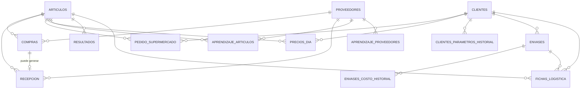

# Diseño de base de datos — Calculador de Precios

Este documento resume el diseño de tablas acordado antes de escribir el
código de la base de datos. Es un documento de referencia: si algo cambia
en el negocio, primero se actualiza acá y después el código.

## Ideas generales

- Casi todo se agrupa por **fecha de operación** (el día al que pertenece
  cada dato, no necesariamente el día en que se cargó).
- La **Recepción** nunca queda cerrada de forma definitiva: Administración
  puede darle un OK, pero eso no impide corregirla después.
- Cuando algo llega tarde (una recepción, un precio, un pedido corregido),
  el **Resultado** de ese día se puede recalcular.
- Los **parámetros del negocio** (descuento, utilidad, costos de envase, kg
  por palet) son editables y guardan historial: un cambio de hoy no debe
  mover los resultados de días pasados.

---

## 1. Artículos

Las fichas de logística de cada producto (hoy en `core/fichas.py`), pero
editables desde la app en vez de fijas en el código.

| Campo | Descripción |
|---|---|
| id | identificador interno |
| nombre | único, editable (ej. "Tomate Redondo") |
| código_interno | código propio del artículo, para no confundirlo con otro aunque cambie el nombre |
| cubetas_por_caja | solo si el cajón del productor viene subdividido en cubetas; dato de recepción |
| unidades_por_cajón / kg_por_cajón | solo para artículos que se pesan por palet (Mango, Palta); dato de recepción, no de reparto a un cliente |
| merma_porcentaje | porcentaje de merma esperado del artículo (0 = sin merma) |
| activo | para dar de baja un artículo sin borrar su historial |

> **Nota:** ni `tipo_envase`/`contenido_caja` NI `unidad_venta` viven acá.
> El mismo artículo puede repartirse en un envase distinto y venderse en
> una unidad distinta según el cliente (ej. Mango: un cliente lo compra
> por unidad, otro por kilo) — los tres campos viven en **Fichas de
> logística por cliente** (punto 12). Acá solo queda lo que es intrínseco
> al producto en sí: cómo llega el cajón del productor al depósito, sin
> importar a qué cliente se le venda ni en qué unidad se le facture.

## 2. Proveedores

| Campo | Descripción |
|---|---|
| id | identificador interno |
| nave | — |
| puesto | — |
| nombre | editable; la última corrección pisa la anterior, sin historial |

La llave real es **nave + puesto**. El nombre es solo un dato descriptivo
que puede corregirse sin cambiar la identidad del proveedor.

## 3. Compras

Cada renglón que carga el comprador.

| Campo | Descripción |
|---|---|
| id | — |
| fecha_operación | día al que pertenece la compra |
| artículo | referencia a Artículos |
| proveedor | referencia a Proveedores |
| cantidad_kilos | dato crudo: cuántos kilos se compraron (opcional si se cargó en fracción) |
| cantidad_fraccion | dato crudo: cuánta "fracción" (unidad o cubeta, según el artículo) se compró (opcional si se cargó en kilos) |
| importe | — |
| seña | opcional, por artículo (no por toda la compra) |
| tipo_retiro | Clark / Carro / Pases (default Clark) |
| palets | — |
| cargado_el | fecha y hora de carga, para auditoría |

Se cargan los **dos datos crudos** de la misma compra cuando aplica (ej.
Mango: 10 unidades, 4 kg) — no un factor de conversión entre kilos y
fracción. `cantidad_fraccion` es un nombre genérico a propósito: significa
"unidad" o "cubeta" según el artículo, pero nunca las dos cosas a la vez
(un artículo que se vende por cubeta jamás se vende por unidad, y
viceversa), así que una sola columna alcanza. De ahí el motor de costeo
deriva costo por kilo (`importe / cantidad_kilos`) y costo por fracción
(`importe / cantidad_fraccion`); qué versión usar la decide la
`unidad_venta` de la ficha de logística del cliente correspondiente (si es
"kilo" usa `cantidad_kilos`; si es "unidad" o "cubeta" usa
`cantidad_fraccion`). Al menos uno de los dos campos tiene que estar
cargado.

Varias compras del mismo día/artículo/proveedor son las que el motor de
costeo promedia ponderando por cantidad.

> **Nota (varios clientes):** el costo de compra queda único, sin distinción
> de cliente. No tiene cliente_id: se compra igual sin importar a qué
> cliente se le vaya a vender después.

## 4. Recepción

Lo que realmente entra al depósito; puede no coincidir con lo comprado.

| Campo | Descripción |
|---|---|
| id | — |
| fecha_operación | — |
| compra | referencia a la Compra correspondiente (vacío si es un agregado fuera de horario sin compra cargada) |
| artículo / proveedor | por si no hay compra vinculada |
| cantidad_recibida | — |
| kilaje_recibido | — |
| es_agregado_fuera_de_horario | sí/no |
| aprobado_por_administración | sí/no — no bloquea la edición, solo indica que fue revisada |
| actualizado_el | para saber cuándo se tocó por última vez y disparar un recálculo |

## 5. Pedido del supermercado

Llega por mail al mediodía, dividido en tres depósitos.

| Campo | Descripción |
|---|---|
| id | — |
| fecha_operación | — |
| cliente | a qué cliente corresponde el pedido |
| sucursal | VL / BZ / GR |
| artículo | — |
| cantidad | ya sumada dentro de esa sucursal si el mail repite el artículo |
| recibido_el | hora de llegada del mail |

Se guarda el desglose por depósito (no solo el total) porque a futuro sirve
para estadísticas por depósito y artículo — por ejemplo, una tabla de
**Rechazos** (mercadería que el supermercado no recibe por calidad) con la
misma forma: fecha + sucursal + artículo + cantidad + motivo. Para el
costeo en sí, se usa la suma de las tres sucursales por artículo.

## 6. Precios del día

Los precios negociados con el supermercado.

| Campo | Descripción |
|---|---|
| id | — |
| fecha_operación | — |
| cliente | a qué cliente corresponde el precio negociado |
| artículo | — |
| precio | — |

Un precio por artículo, por día y por cliente, sin distinción de sucursal
(el mismo precio aplica a los tres depósitos de un mismo cliente). Puede
cambiar de un día a otro sin riesgo de confusión porque cada artículo tiene
su código propio y estable.

## 7. Aprendizaje (memoria de abreviaturas)

Dos listas separadas, porque resuelven cosas distintas:

### 7a. Aprendizaje de artículos

| Campo | Descripción |
|---|---|
| proveedor | de quién es la comanda |
| texto_leído | ej. "Tom R" |
| artículo | a qué artículo corresponde (ej. "Tomate Redondo") |

### 7b. Aprendizaje de proveedores

| Campo | Descripción |
|---|---|
| texto_leído | ej. membrete o firma de la comanda |
| proveedor | a qué proveedor corresponde |

Estas listas crecen con el tiempo y complementan las reglas fijas que ya
están en el prompt de `lector_comandas.py` (como "M rojo = Morrón Rojo").

## 8. Parámetros del negocio

Guarda lo que sigue siendo **genuinamente global** (no depende del
cliente), con historial de cambios. Por ahora, el único parámetro acá es
`kg_por_palet`.

`descuento_estandar`, `utilidad_estandar`, `costo_envase_chico` y
`costo_envase_grande` **ya no viven acá**: el descuento y la utilidad
ahora son por cliente (ver punto 10), y el costo de envase vive en cada
Envase (ver punto 11).

| Campo | Descripción |
|---|---|
| nombre_parámetro | ej. "kg_por_palet" |
| valor | — |
| vigente_desde | fecha a partir de la cual rige este valor |

Al calcular o recalcular el resultado de una fecha puntual, se usa el valor
que estaba vigente **en esa fecha** (no el de hoy). Un cambio nuevo solo
afecta desde su fecha en adelante; los días pasados no se mueven.

## 9. Resultados (calculado)

No es un dato que carga alguien a mano: es la salida del motor de costeo
(costo ponderado, precio sugerido, utilidad real, cantidad de cajas,
palets) guardada por día y artículo, para no recalcular todo desde cero
cada vez que se abre una pantalla. Cuando llega una recepción tardía o se
corrige un precio o un pedido, este registro se vuelve a calcular.

| Campo | Descripción |
|---|---|
| fecha_operación | — |
| artículo | — |
| costo_ponderado | — |
| precio_sugerido | — |
| utilidad_real | — |
| cantidad_cajas / palets | — |
| recalculado_el | última vez que se recalculó |

## 10. Clientes

Antes el sistema asumía un solo cliente implícito (el supermercado "Día"),
con un descuento y una utilidad únicos y globales. Ahora cada cliente tiene
los suyos propios, con historial de vigencia (mismo criterio que
Parámetros del negocio: un cambio de hoy no mueve los días pasados).

| Campo | Descripción |
|---|---|
| id | — |
| nombre | único (ej. "Día") |
| activo | para dar de baja un cliente sin borrar su historial |

**Historial de descuento y utilidad por cliente:**

| Campo | Descripción |
|---|---|
| cliente | — |
| nombre_parámetro | 'descuento' o 'utilidad_objetivo' |
| valor | — |
| vigente_desde | fecha a partir de la cual rige este valor |

## 11. Envases

Antes el costo de envase (chico/grande) era único y global. Ahora cada
cliente tiene sus propios envases, cada uno con su propio costo con
historial.

| Campo | Descripción |
|---|---|
| id | — |
| cliente | dueño de este envase |
| nombre | ej. "Caja Chica Día" |
| activo | — |

**Historial de costo del envase:**

| Campo | Descripción |
|---|---|
| envase | — |
| costo | — |
| vigente_desde | fecha a partir de la cual rige este costo |

## 12. Fichas de logística por cliente

**Única fuente de verdad** de en qué unidad se vende cada artículo para
cada cliente, qué envase usa, y cuánto contenido trae la caja en ese caso
puntual. Reemplaza a los campos `tipo_envase`/`contenido_caja`/
`unidad_venta` que antes vivían (únicos, sin distinción de cliente) en
Artículos. El mismo artículo puede tener `unidad_venta` distinta según el
cliente (ej. Mango: un cliente lo compra por unidad, otro por kilo).

| Campo | Descripción |
|---|---|
| id | — |
| artículo | — |
| cliente | — |
| unidad_venta | kilo / unidad / cubeta, para este artículo + cliente |
| envase | vacío si no usa un envase compartido (se entrega en su propio cajón) |
| contenido_caja | cuánto trae la caja para este artículo + cliente (vacío si no usa envase compartido) |

---

## Relaciones



Artículos, Proveedores y Clientes son los catálogos de donde cuelga todo lo
demás. Compras, Recepción, Pedido del supermercado y Precios del día
apuntan a un artículo (y las que corresponde, a un proveedor y/o cliente),
agrupados por fecha_operación. Aprendizaje conecta texto crudo con
artículos/proveedores. Parámetros y Resultados no dependen de nada:
Parámetros alimenta el cálculo, y Resultados es la salida. Clientes tiene
su propio historial de descuento/utilidad y sus propios Envases (con su
propio historial de costo); Fichas de logística conecta un Artículo con un
Cliente y el Envase que usa.

## PARA RETOMAR — anotado el 02/09/2026, con el lote de "elegir del stock" terminado

**Se para acá a propósito y no se arranca nada más.** Esta semana entraron el
corte y cinco entregas. **El lunes 31/08 se rompió justo por tener piezas a
medias**, y ahora que están completas hay que verlas andando con gente real
antes de construir encima. Lo mismo que se decidió el 29/08 y por lo mismo:
acumular cambios sin ver ninguno andando en la operación real es cómo se
llega a no poder distinguir qué rompió qué.

### Lo que quedó terminado y desplegado

- **El freno del reproceso y su desglose editable.** 100% o nada: si no hay
  stock a la fecha no se carga, y `crear_reproceso` **ya no puede escribir un
  `sin_lote`** — el camino por el que nacía una guía con costo incompleto
  para siempre.
- **La salida de escape del freno, sacada** de punta a punta: la pantalla de
  Operarios, la tabla `operarios_deposito` y las dos columnas de la
  excepción. El motivo está escrito para que no vuelva a proponerse.
- **La pasada global de dirigidas en `atribuir_costos_fifo`**, que puso a los
  dos FIFO a emparejar igual.
- **La Entrega 3**: el que arma un pedido dice de qué lote lo sacó. Avisa y
  no traba.

### Las dos que son LA MISMA PREGUNTA

Y la pregunta es **cuántas correcciones hace el depósito de verdad**. Las dos
se contestan mirando el sistema andando, no razonando:

1. **La función de emparejamiento única** (el "Nivel 2", con su sección
   propia más abajo). Hoy los dos FIFO emparejan igual porque se los
   arregló, no porque no puedan separarse. Con la Entrega 3, cada renglón
   corregido es una salida señalada: de raro pasa a rutina.
2. **La corrección del armado no se ve desde ningún listado** (su
   observación, más abajo). Si se corrige seguido, van a existir costos que
   eligió una persona y nadie va a poder distinguir de los que calculó el
   sistema.

Si el depósito corrige poco, las dos pueden esperar. Si corrige mucho, las
dos se vuelven necesarias — y en ese orden.

### El resto de la cola, sin orden entre ellas

- **E6** (la etapa que falta del plan del modelo nuevo).
- **El corte de Palmala.** Antes hay que **reescribir los scripts del corte
  sin tablas temporales** y **correr los chequeos 04, 05, 11 y 12**, que
  nunca se corrieron (ver `db/APLICADO.md`).

  **DECIDIDO el 04/09: Palmala todavía no lleva stock, y no lo va a llevar
  hasta que Frutamax funcione fino.** Cuando arranque, arranca con un **corte
  limpio y sin arrastre**. Consecuencia práctica y hay que tenerla presente:
  **ninguna corrección de datos que se haga en Frutamax se replica en
  Palmala** — ni el backfill de las fichas de los pedidos, ni ninguna otra.
  Palmala no tiene el problema porque no tiene los datos. Cualquier "hay que
  correrlo también allá" es un reflejo, no un pendiente.
- **E0 fase 3**: el rename de las 19 rutas `/deposito/*` que hoy son de
  Administración.
- **La lentitud de Frutamax.**
- Las **guías R atrasadas**; el **reparto congelado contra el vivo**; el
  **envase**; la **alerta de cruce que aparece y desaparece sola**; el
  **tilde de retiro**.
- La etiqueta de `cierre_modelo_viejo` en `ETIQUETAS_MOVIMIENTO_STOCK`;
  `verificar_esquema.sql` va por 14 de 41 tablas; `conteo_id` en
  `ajustes_vacios`; **Costos Fijos tanda 2**.

## Para retomar (anotado el 29/08/2026, antes del corte)

Se corta acá a propósito. **Quedan desplegadas E0 (parcial), E1, E2, E3 y
E5.** El lunes 31/08 arranca el modelo nuevo y se lo mira funcionar unos
días antes de seguir tocando: acumular cambios sin ver ninguno andando en
la operación real es cómo se llega a no poder distinguir qué rompió qué.
El domingo se carga el stock inicial a mano.

En orden, para el martes o miércoles:

1. **E4 — el FIFO que no viaja al futuro.** Va **sola y primera** (decisión
   del dueño el 31/08): mueve costos, y con otros cambios encima no se
   distingue el arreglo del ruido. Toca `atribuir_costos_fifo`
   (`core/costo_real.py`) y `repartir_fifo` (`core/stock.py`). No cambia
   ninguna pantalla. Sin migración.
   **Antes de tocar `repartir_fifo` hay que contestar la pregunta de la
   fecha del reproceso** — ver "las guías R atrasadas quedan fechadas
   después de las salidas que explican", más abajo. Y al leer los costos de
   la primera semana, tener presente el arrastre del lunes que esa misma
   sección describe: va a parecer que E4 quedó mal y no va a ser E4.

2. **Elegir del stock que hay** — el lote de tres piezas que ya se perdió del
   plan tres veces: el **freno por stock del reproceso**, su **desglose
   editable**, y **la misma elección en el armado de pedido** (que E5 dejó con
   los dos avisos y sin la elección). Las tres van juntas y **después de E4**,
   porque las tres necesitan lo mismo: saber qué había en cada lote a una
   fecha. En el reproceso la edición viene con freno —ahí se congela un costo
   que no se corrige nunca—; en el armado **avisa y no traba**, igual que hoy.
   Todo el detalle en "Pendiente con nombre propio: elegir del stock que hay",
   más abajo.

3. **E6 — las alertas.** Se puede hacer en cualquier momento, no depende
   de que haya datos. Cuenta **solo los reprocesos posteriores al
   31/08/2026**: si contara todos, Frutamax nacería con 36 casos que
   nadie puede resolver, y una alerta que arranca en rojo permanente se
   deja de mirar. Incluye la advertencia en Gerencia con el número de
   bultos sin costear.

4. **El retenido de Stock Físico**, en la rama
   `claude/retenido-stock-fisico` (commit `597896e`): "buscar los conteos
   de un día". **Tiene cruce con E3**, que reescribió esa misma pantalla
   —el artículo pasó a vivir en la URL y se agregó el campo "Qué
   contaste"—, así que no se aplica tal cual: hay que rehacer la búsqueda
   por día sobre la pantalla nueva.

5. **La lentitud de Frutamax**, que sigue sin diagnosticar. Lo medido: el
   costo está en **abrir la conexión**, no en la consulta — las dos
   pantallas que se sienten normales (`/gerencia` y `/`) son las únicas
   con cero conexiones, y la base no muestra nada corriendo. Hipótesis
   principal sin verificar: comparar los dos `DATABASE_URL` en Railway
   (directo contra pooler; timeouts de fallback IPv6). Los tres SQL de
   comparación de volumen, índices y conexiones siguen sin correr.

6. **Reescribir los scripts del corte sin temporales, y correr el verificador
   que nunca corrió** (`db/corte_frutamax_*`). El corte se aplicó, pero el
   script **falló en el editor de Supabase y escribió igual**: ahí
   `begin ... commit` no es atómico y las tablas y vistas temporales no
   sobreviven de una sentencia a la siguiente. Terminó bien por casualidad.
   **El verificador de las 12 nunca se corrió** —tiene el mismo defecto—, así
   que el corte se respaldó con dos consultas de una sola sentencia armadas a
   mano: stock por artículo contra la foto con las seis patas, los cuatro
   conteos, y la plata. **Quedaron sin verificar las verificaciones 04, 05, 11
   y 12**: sueltos negativos (el síntoma de las cajas fantasma), cajas por
   ficha, que el FIFO arranque limpio, y que ningún lote con resto haya
   quedado sin precio. Reescrito el verificador, **se corre en Frutamax para
   cerrar ese hueco**, aunque sea después del arranque. Los dos archivos
   quedaron con un cartel de "no reusar" arriba y **hay que reescribirlos
   antes del corte de Palmala**, que sigue pendiente. La regla que sale de acá
   está en `CLAUDE.md`. El incidente completo, en `db/APLICADO.md`.

7. **La etiqueta de `cierre_modelo_viejo`** en `ETIQUETAS_MOVIMIENTO_STOCK`
   (`app/main.py`). Hoy el tipo nuevo se ve como texto crudo en Movimientos
   de Stock. No rompe nada (el `.get()` tiene fallback), es solo feo. Sin
   urgencia y sin migración.

## El plan del modelo nuevo (E0–E6)

Aprobado el 28/08/2026 **con el orden tal cual**, y anotado acá el
29/08 porque hasta entonces solo vivía en el chat: se perdió una vez y
frenó el arranque de una etapa. El orden no es de conveniencia, es de
dependencia — cada una necesita que la anterior exista.

| # | Qué | Estado |
|---|-----|--------|
| **E0** | Rename Facturación → Administración + reordenamiento de navegación | Fases 1 y 2 y el "resto" (los botones de atrás) **en main**. **Fase 3 diferida**: partir `/deposito/pedido`. |
| **E1** | `ficha_id` en `reprocesos` + "sin asignar" explícito | **En main** |
| **E2** | Fecha de corte (31/08/2026) y stock inicial con tipo propio | **En main** |
| **E3** | `conteos_stock` con `ficha_id`; Stock Físico y Cotejo por porción | **En main** |
| **E4** | El FIFO que nunca consume un lote posterior a la salida | Pendiente, **a propósito después del lunes**. De ella cuelgan las tres piezas de "elegir del stock que hay": el freno por stock, el desglose editable del reproceso y el del armado de pedido. Sin E4, trabar rompe la carga con demora y el desglose que se muestre estaría mal (ver la sección, más arriba) |
| **E5** | El pedido descuenta del formato de la ficha, no del artículo, con la tolerancia | En curso |
| **E6** | Alerta de reprocesos sin asignar + advertencia en Gerencia | Pendiente |

**E1 es la piedra angular** y por eso va primera: sin saber a qué ficha
fueron las cajas de una guía R no existe el número contra el cual
comparar, y E3 no se puede hacer.

**E4 va después del lunes a propósito.** Toca `atribuir_costos_fifo`
(`core/costo_real.py`) y `repartir_fifo` (`core/stock.py`) para que el
FIFO nunca consuma un lote posterior a la salida. Eso **mueve números**,
y con datos viejos adentro no se puede distinguir el arreglo de la
basura previa: haría falta decidir si un cambio es la corrección o el
ruido de lo que ya estaba mal. Con el corte pasado, cualquier cambio que
se vea es el arreglo. No necesita migración.

**E6** cuenta **solo los reprocesos posteriores al 31/08/2026**. Si
contara todos, Frutamax nacería con 36 casos que nadie puede resolver, y
una alerta que arranca en rojo permanente es una alerta que se deja de
mirar. Incluye la advertencia en Gerencia con el número de bultos sin
costear.

**Lo que NO es una etapa:** la ventana de 10 días (diez días y dentro
del mes en curso) pertenece a la **carga retroactiva en
Administración**, que todavía no está asignada a ninguna etapa.

## Pendiente con nombre propio: elegir del stock que hay (freno + desglose del reproceso + armado de pedido)

Relevado el 29/08/2026, después de que una guía R real tomara 300 bultos
de un artículo que no los tenía.

**Por qué se perdió**: el plan E0–E6 se armó sobre tablas y pantallas, y
estas dos piezas no son ni una cosa ni la otra. E1 agregó `ficha_id` a
`reprocesos`, pero ninguna etapa dijo "el reproceso toma lotes reales".
Quedó afuera de todas.

### El reproceso es la excepción a "avisa, no traba"

En todo el sistema la regla es avisar y no trabar: el conteo físico es
declarativo, el armado de pedido avisa por tolerancia y por falta de
cajas, la merma no se discute. El piso es la verdad.

**El reproceso es distinto, y por una razón concreta: es el único acto
del operario que CONSUME LOTES Y CONGELA COSTO.** Los demás declaran un
hecho que se corrige solo —el próximo conteo pisa al anterior, un renglón
se destilda— o registran una salida que realmente ocurrió. El reproceso,
en cambio, escribe `reprocesos_consumos` con el costo de cada lote
congelado en ese instante, y ese costo es el que después alimenta el
costo de la primera, la rentabilidad real y el precio de las cajas que
salgan de ahí. Un número tomado de más no queda como una diferencia a la
vista: queda como un consumo `sin_lote` sin precio posible, que deja la
guía con costo incompleto **para siempre** — no hay compra a la que ir a
buscarle el importe, porque esos bultos no existieron.

Por eso acá trabar no contradice el criterio: lo que se protege no es el
stock, es el costo.

### LA REGLA: el reproceso es 100% o nada

**El reproceso se hace 100% bien o no se hace.** El que puede quedar
suelto es el armado del pedido, no este. Un pedido puede salir con
mercadería que el sistema no tiene y eso se resuelve después; un
reproceso mal cargado congela un costo que no se corrige nunca.

De esa regla salen las dos piezas del reproceso, y van juntas:

1. **Si no hay remanente en el sistema, no se puede cargar. Punto.** No
   es "avisa y sigue", no es `sin_lote`. Se traba.
2. **El operario dice artículo y cantidad, y el sistema le muestra el
   desglose** que armó por FIFO: qué lotes, de qué proveedor, qué
   cantidad de cada uno. Él confirma, o lo modifica **dentro de lo que
   hay de cada lote**. La edición es OPCIONAL: si no quiere mirar nada,
   confirma y listo.

**Esto ya se perdió TRES veces. Que no pase una cuarta.**

- La primera, del plan E0–E6: se armó sobre tablas y pantallas, y esto no
  es ni una cosa ni la otra. E1 agregó `ficha_id` a `reprocesos`, pero
  ninguna etapa dijo "el reproceso toma lotes reales".
- La segunda, el 29/08: se sacó el desglose editable del alcance por
  considerarlo "revertir una decisión". Era al revés — la decisión que
  había que revertir era justamente esa.
- Y la misma pieza en el **armado de pedido** se perdió sin que nadie la
  nombrara: estaba definida en la conversación de diseño y E5 salió con los
  dos avisos y sin la elección. No se discutió sacarla; simplemente no entró.

### DECIDIDO (02/09): la salida de escape del freno NO va, y no vuelve

**Se propuso, se diseñó, se migró — y se sacó antes de escribir una línea
del código que la usaba.** Queda anotada acá, con fecha y con el motivo,
para que dentro de tres meses no vuelva a aparecer como si fuera una idea
nueva.

**Qué era.** Cuando el freno trabara, dejarlo cargar igual marcando el
reproceso como excepción: un motivo escrito a mano y el operario que la
usó, elegido de una lista. De ahí salieron la tabla `operarios_deposito`,
la pantalla Administración → Depósito, y las columnas
`reprocesos.excepcion_motivo` y `reprocesos.excepcion_operario_id`.

**Por qué se sacó: contradecía una decisión que ya estaba tomada y
justificada acá arriba.** *"El reproceso se hace 100% bien o no se hace."*
*"Si no hay remanente en el sistema, no se puede cargar. Punto. No es
'avisa y sigue'."* Una excepción con motivo **es** "avisa y sigue" con más
pasos: el reproceso queda cargado igual, el costo queda congelado igual, y
lo único que se gana es un texto que nadie va a leer — salvo el día en que
alguien vaya a buscar por qué esta guía tiene el costo mal, que es
exactamente el día en que ya no se puede arreglar.

**Y el argumento que la sostenía no existe.** Se propuso para no frenar la
operación, pero **el freno no frena la operación**: el pedido sale igual,
el camión sale igual. Lo único que se traba es la carga de la guía R, y
eso se destraba yendo a cargar lo que falta — una recepción, un ingreso, o
la guía R que armó esa mercadería. Esa mercadería hay que cargarla de
todas formas. La excepción no ahorraba trabajo: solo permitía no hacerlo.

**Si el freno traba seguido, la respuesta NO es la excepción.** Es una de
dos, y las dos se arreglan cargando bien, no anotando por qué no se
cargó: o la fecha del reproceso está mal (para eso está la ventana
retroactiva del 31/08), o falta cargar mercadería.

**Lo que queda del diseño de la excepción** —la lista de operarios, el
motivo de 10 caracteres, el segundo toque en la pantalla— **se va con
ella.** No es material reutilizable esperando otro uso: existía para
sostener esta idea y sin ella no sostiene nada.

### La tercera pieza: el armado de pedido tampoco deja elegir del stock

Anotado el 29/08/2026. **Es la misma pieza aplicada a la otra pantalla**, y
también quedó definida en la conversación de diseño y nunca se implementó:
**E5 dejó solo los dos avisos** (la tolerancia de kilos y el de "no hay cajas
de esta ficha"), no la elección.

Hoy el que arma un pedido tilda un renglón y el sistema descuenta del stock
del artículo sin decir de dónde. **Tiene que ser lo mismo que el reproceso:
default por FIFO, edición OPCIONAL dentro de lo que hay.** El que arma dice
artículo y cantidad; el sistema propone de qué lotes sale; él confirma, o lo
corrige dentro del remanente de cada lote.

**La diferencia con el reproceso es el freno, y sigue en pie:** el armado
**avisa y no traba**. Un pedido puede salir con mercadería que el sistema no
tiene —el piso es la verdad, el camión sale igual— y el sobrante cae a
`sin_lote` como hoy. Lo que cambia no es si se puede armar, sino que el que
arma pueda **decir de dónde salió** en vez de que lo adivine el FIFO a
posteriori. En el reproceso la misma edición viene con freno porque ahí se
congela un costo que no se corrige nunca; acá no.

**Va en el MISMO LOTE que el desglose del reproceso, después de E4**, y por la
misma razón: las dos piezas necesitan saber **qué había en cada lote a una
fecha**, y eso es exactamente lo que E4 deja listo. Antes de E4, el desglose
que se le muestre al que arma un pedido cargado con demora estaría mal por la
misma causa que rompería el freno.

### DECIDIDO (01/09): contra qué número compara el freno

**Contra la SUMA DE LOS RESTANTES DE LOS LOTES, no contra el neto.**

Ese número **nunca puede ser negativo**: los restantes son ≥ 0 por
construcción, y el negativo del neto vive en `sin_lote`, que es otra cosa. Con
eso la pregunta "¿qué pasa cuando el stock a esa fecha ya viene negativo?" no
llega a plantearse — el freno no mira ese número. Era la objeción del dueño y
es la que forzó este diseño: trabar a un operario por un agujero que ya estaba
ahí antes de que tocara nada sería trabarlo por lo mismo que está arreglando.

**El recorte es asimétrico, a propósito: entradas HASTA la fecha inclusive,
salidas HASTA EL DÍA ANTERIOR.** Las salidas del mismo día no cuentan.

Sale de la regla que E4 ya fijó: **dentro de un día el sistema no tiene
orden** — guarda fechas, no horas. Descontar una salida del mismo día es
afirmar un orden que no sabemos, y afirmarlo justo en contra del que está
reprocesando. Es la misma simetría que ya aceptamos del otro lado: un lote
cargado a la tarde cubre una salida de esa misma mañana.

Medido con el código, sobre el caso real del 31/08 (Zapallito: 44 sueltos + 25
cajas del corte, y el depósito arma 69 cajas ese mismo día antes de cargar la
guía R). El operario carga después la guía que falta, tomando 44:

```
neto al cierre del día        disponible =  0   ->  LO TRABA
salidas del día no cuentan    disponible = 69   ->  PASA
```

**Y no es un colador.** Los dos casos de inconsistencia real siguen trabados:

```
toma 20 con fecha 03/08 y ese día solo había 5 comprados       -> TRABA
comprado el 20/08, salió entero el 25/08, reproceso del 31/08  -> TRABA
```

### Reglas de pantalla del freno y el desglose (01/09)

**~~El motivo de la excepción pide un mínimo de 10 caracteres.~~ ANULADA el
02/09: se fue con la salida de escape.** Se deja anotada porque el
razonamiento sigue valiendo si algún día aparece otro texto que escriba un
operario apurado —el blanco lo rechaza el check, pero "ok" y "urgente"
pasan, y son inútiles justo el día en que se los va a leer—. Pero **hoy el
sistema no tiene ningún mínimo de largo**, y no lo tiene a propósito: era
el único, y existía solo para la excepción.

**El desglose por lote muestra lo MÍNIMO para elegir: fecha y cantidad.** El
proveedor aparece **solo cuando hace falta para distinguir dos lotes del mismo
día**. En 390px un renglón cargado de datos se vuelve ilegible y el operario
deja de mirarlo — que es exactamente lo contrario de lo que el desglose busca.
La regla es de la pantalla, no del dato: el detalle completo sigue estando en
Guías R, que es de Administración.

### Lo que el freno NO cubre, y qué hacer cuando pase

**Si el reproceso es de un día y las cajas salieron el día ANTERIOR, se
traba.** Es correcto —la mercadería salió antes de existir— pero le va a pasar
al depósito cada vez que arme después de medianoche o cargue la fecha corrida
un día.

**Si eso empieza a pasar seguido, la respuesta NO es aflojar el freno: es
que la fecha del reproceso está mal cargada**, y para eso está la ventana
retroactiva que se decidió el 31/08. Queda escrito acá para que la primera
racha de trabas no se lea como "el freno molesta" — que fue, textualmente,
de dónde salió la salida de escape que se sacó el 02/09.

### Las tres objeciones, y por qué ninguna alcanza para recortarlo

**La regla de operario.** El desglose son números del sistema, sí. Pero
acá el operario los necesita **para hacer bien su trabajo**, no para
transcribirlos en un conteo. La regla existe para que no arme contra el
sistema en vez de contra el piso: en el reproceso **el piso ya lo declaró
él** (dijo cuántos cajones toma), y lo que ve después es de dónde sale el
costo. Si eso obliga a que Reproceso deje de tratarse como pantalla
ciega, que deje de serlo.

**"Nadie elige lote — lo reparte el sistema"**, en el docstring de
`crear_reproceso` y en la pantalla de Stock por Guía: **eso es lo que hay
que cambiar**, junto con el texto. No es una restricción de diseño a
respetar; es lo que se está corrigiendo.

**La concurrencia** entre el preview y el guardado: es real, y se
resuelve revalidando en el server al escribir y devolviendo una propuesta
fresca si algo cambió. Es trabajo, no un impedimento.

### El orden: E4 primero, y esto sí es un bloqueo técnico

**El freno no se implementa hasta que el FIFO respete la fecha de la
operación**, y eso es la **etapa 4**. No es una preferencia:
`_entradas_y_salidas_stock` usa el estado ACTUAL sin filtro de fecha, y
la pantalla acepta cargar con `fecha_operacion` pasada. Un reproceso de
ayer cargado hoy, cuyas cajas ya salieron en pedidos, chocaría contra una
pared. **Cargar con demora es normal en el depósito**: el freno sin E4
rompe la operación en vez de protegerla.

**Lo que E4 tiene que dejar listo** (relevado el 29/08): hoy conviven DOS
FIFO. El del COSTO (`salidas_stock_articulos` + `atribuir_costos_fifo`)
ya trabaja con **cada salida individual, fechada, tipada y en orden
cronológico** — incluido `reproceso_toma`. El del STOCK
(`_entradas_y_salidas_stock_varios` + `repartir_fifo`) usa **un total sin
fecha**: `salidas_para_reparto` arma una sola salida con `orden: 0`. E4
es hacer que el del stock use las salidas fechadas que el del costo ya
tiene, y que un lote no pueda ser consumido por una salida ANTERIOR a su
propia fecha.

Con eso, el freno pregunta lo único que necesita: **qué quedaba en cada
lote a la fecha del reproceso**.

### Otro argumento para el freno: hay costos que NO se pueden completar nunca

Relevado el 29/08 al investigar el botón **"Completar costo"** de Guías R.

Ese botón rellena `reprocesos_consumos.costo_por_bulto` con el
`compras.importe` del lote del que salió cada consumo — solo donde está
en NULL, sin pisar nunca un costo congelado. Sirve para el caso real: se
reprocesó a la tarde consumiendo la compra de la mañana, que todavía no
tenía precio; cuando el precio se carga, el botón cierra el costo.

**Pero un consumo `sin_lote` tiene `compra_id` en NULL.** No salió de
ninguna compra —son bultos que no existían— así que el `UPDATE` nunca lo
alcanza. Ese botón **no puede completar un `sin_lote`, ni hoy ni nunca**,
y mientras quede uno la guía se queda con `costo_total` en NULL para
siempre.

Verificado contra la base: con el precio de la compra cargado, el botón
completa ese consumo y deja el `sin_lote` intacto; `costo_total` no se
cierra.

Es decir: **hoy el sistema deja crear una guía cuyo costo no se puede
completar nunca, ni a mano ni automáticamente.** No es que falte una
pantalla para arreglarlo — no hay nada que arreglar, el dato no existe.
La única forma de que ese caso no aparezca es que la guía no se pueda
crear, que es exactamente el freno.

### Lo que el freno NO resuelve, aunque se implemente bien

**Trabar es una foto, no una garantía.** Los consumos se congelan al
cargar, pero los lotes que consumieron se pueden corregir después — una
recepción editada a la baja, por ejemplo. Una guía que pasó el chequeo
puede quedar sobreconsumida igual.

No invalida el freno: tapa la puerta de entrada, que es por donde entran
los casos que se vieron. Está escrito para no creer que resuelve más de
lo que resuelve. Cerrar ese agujero (revalidar los consumos cuando cambia
un lote) es otra cosa y todavía no tiene dueño.

### LO QUE EL FRENO CIERRA DE VERDAD (02/09, con el Merge B ya escrito)

**`crear_reproceso` ya no puede escribir un `sin_lote`.** Ese era el
agujero de fondo — una guía con costo incompleto para siempre, sin compra a
la que irle a buscar el importe. **El freno no es solo una traba: cierra el
camino por el que nacía plata imposible de costear.**

Es la frase que hay que leer si alguna vez el freno parece caro. Lo que se
compra con él no es prolijidad de stock: es que no vuelva a existir un
bulto que salió, que se cobró, y cuyo costo no se puede completar nunca —
porque esos bultos no existieron y no hay dónde ir a buscarles el precio.
Trabar la carga, en cambio, cuesta ir a cargar una recepción que hay que
cargar igual.

**Corolario de pantalla, y es la excepción correcta a "avisa, no traba":**
el desglose muestra "Repartido 14 de 20 — faltan 6" y **Guardar no sale
hasta que cierre**. Un reparto que no suma no es una diferencia entre el
piso y el sistema —esas se respetan siempre— sino **un reparto mal hecho**,
y la diferencia no tiene dónde caer: el `sin_lote` que la habría absorbido
es justamente el que se cerró. El reproceso es 100% o nada también acá
adentro.

### `sin_lote` no desaparece: se angosta

Son DOS cosas distintas con el mismo nombre, y solo una se apaga al
trabar:

- **El consumo guardado** (`reprocesos_consumos.origen = 'sin_lote'`) lo
  escribía únicamente `crear_reproceso`, y desde el Merge B **ya no puede
  escribirlo**: el freno levanta antes de insertar nada. Pero **sigue
  existiendo para las viejas** — Frutamax ya tiene guías con esos consumos.
  `completar_costo_reproceso` y la pantalla de Guías R tienen que seguir
  tratándolo.
- **El sobrante calculado** (`repartir_fifo(...)["sin_lote"]`, en
  `core/stock.py`) es el resto de CUALQUIER salida que ningún lote cubre:
  renglones armados, mermas, ajustes negativos. Ese **sigue igual**,
  porque armar un pedido no traba (la etapa 5 avisa y nada más).
  Alimenta "Salidas sin lote" en Stock del Sistema, el cartel de Stock
  por Guía, y el motivo `sin_lote` de la Rentabilidad Real.

O sea: trabar el reproceso lleva `sin_lote` de dos fuentes a una. El
concepto y sus pantallas se quedan.

## Pendiente con nombre propio: las guías R atrasadas quedan fechadas después de las salidas que explican

> **Cómo se ve esto desde la pantalla (agregado el 04/09).** Un
> `sin_procesar` negativo en Stock del Sistema **es este mismo problema**,
> mirado desde el otro lado. Ver la sección de la cuenta 3, más abajo: la
> aritmética cierra, y lo que el número está diciendo es que hay guías R
> fechadas después de las salidas que deberían cubrir.
>
> **Y ahí hay un problema de diseño propio, que no es urgente pero es real:**
> el operario lee *"−48 sin procesar"* y entiende **que faltan 48 bultos**.
> Lo que falta son **guías R**. Es una señal disfrazada de número de stock, en
> la misma columna donde todos los demás números sí son bultos.
>
> Eso **se dice con palabras, no con un número negativo**. Un cartel del tipo
> *"hay salidas anteriores a las guías R que las explican"* comunica lo que
> pasa; un −48 en una columna de bultos comunica lo contrario de lo que pasa
> — e invita a un ajuste, que es justo lo que no hay que hacer.
>
> No está diseñado ni pedido. Queda acá y no como pendiente aparte **a
> propósito**: es esta misma cosa vista desde la pantalla, y separarlos haría
> que se arreglara uno y quedara el otro.


Anotado el 31/08/2026, **antes de E4 y antes de mirar los costos de esta
semana**. Se escribe ahora justamente para no confundirlo después con un error
de E4.

### Qué pasa

El lunes 31/08 el depósito armó cajas de varias fichas **antes** de cargar sus
guías R, y el selector de Reproceso escondía esos artículos (ver la Entrega 0).
Con el selector arreglado, esas guías se cargan **con fecha de hoy** — no con
la del día en que la mercadería se procesó de verdad en el galpón.

**E4 ordena el FIFO por la fecha real del hecho.** Con eso, una guía R cargada
tarde queda fechada **después** de las salidas que la explican: el renglón de
pedido salió el lunes, y la primera que lo cubre nace el martes. Un lote no
puede ser consumido por una salida anterior a su fecha — que es exactamente la
regla que E4 viene a imponer— así que esas salidas del lunes van a caer a
`sin_lote` y a quedar sin costear.

### Por qué hay que tenerlo escrito

**Va a parecer que E4 quedó mal, y no va a ser E4.** Es la secuela del arrastre
del lunes: datos cargados fuera de orden, no una regla mal implementada. Sin
esto anotado, la primera lectura de los costos de la semana manda a revisar el
código nuevo en lugar de mirar las fechas de las guías.

Es acotado y no se propaga: solo alcanza a las guías R del arrastre. Una vez
que el depósito vuelva al orden normal —reproceso primero, armado después— el
problema no vuelve a aparecer **por esta causa**.

### DECIDIDO (31/08): la fecha hacia atrás entra, y entra por la ventana retroactiva

**¿Conviene que el operario pueda cargar un reproceso con fecha anterior?
Sí.** Decisión del dueño el 31/08.

El argumento que la decide: **la fecha real ya es la regla en todo el resto
del módulo** — `fecha_operacion` en compras, movimientos y reprocesos está
documentada como "la fecha REAL del hecho, puede no ser la de carga". El
reproceso cargándose siempre con fecha de hoy es la excepción, no al revés. Y
sin esto, **cada atraso ensucia el costeo**: no es un caso raro, es lo que pasa
todas las semanas.

**Por dónde entra: la ventana retroactiva de Administración**, con su "Guardar
igual" y motivo escrito. **NO como campo libre en la pantalla del operario.**
Mismo criterio que la excepción del freno: posible, visible y contable, pero
nunca tan cómoda como el camino normal.

> **CORRECCIÓN DEL 04/09 — este párrafo describía algo que ya era falso el día
> que se escribió.** El campo de fecha existe en la pantalla del operario
> **desde el 25/08** (`869448a`, la primera tanda del reproceso):
> `<input type="date" name="fecha" max="{{ hoy }}">`, con techo y **sin piso**,
> y la única validación del POST era "no puede ser futura". La ventana
> retroactiva de Administración, en cambio, **nunca se escribió**: no hay un
> solo camino en el código que edite la `fecha_operacion` de un reproceso ya
> cargado.
>
> O sea que durante seis días el documento afirmó lo contrario de lo que hacía
> el sistema: decía que la fecha hacia atrás **entraría** por una pantalla que
> no existe, mientras el operario ya la tenía libre y sin límite. Y la pared
> del freno lo **invitaba** expresamente — *"Fijate también la fecha: si el
> reproceso fue otro día, cambiala acá abajo."*
>
> Es el mismo síntoma de las dos familias: un texto que no mintió cuando se
> escribió, salvo que este sí — nadie fue a mirar la pantalla. **Lo que faltaba
> no era la capacidad: era el piso y el aviso.** Los dos entraron el 04/09 (ver
> "El piso de la fecha y el aviso de la fecha hacia atrás", abajo).

### Lo que la ventana NO resuelve: el documento congelado y el reparto vivo

Una fecha hacia atrás mete un lote **antes** de salidas ya costeadas. Los
consumos de las guías R posteriores están congelados en `reprocesos_consumos` y
**no se recalculan nunca**. Queda el documento diciendo una cosa y el reparto
vivo diciendo otra. Relevado en el código el 31/08:

**1. Qué tan grave es, y si se ve.**

**La plata NO diverge.** `reprocesos.costo_total` y `costo_por_bulto_primera`
quedan congelados al cargar, y el FIFO vivo usa `rp.costo_por_bulto_primera`
como costo del lote de primera. O sea que **todo lo que está río abajo de una
guía R usa el número congelado**: un lote retroactivo insertado antes no mueve
ni un peso ya informado.

Lo que diverge es **la trazabilidad**: de qué lote dice la guía R que salió cada
bulto. Y es **silenciosa por construcción**, porque las dos versiones no se
cruzan en ninguna pantalla:

- El documento congelado se lee en **tres lugares** (revisado el 04/09; el
  relevamiento del 31/08 decía "uno solo" y nombraba una función que ya no
  existe, `listar_reprocesos_con_consumos`): `listar_reprocesos_por_rango` → la
  pantalla de Guías R; `dependencias_del_lote_de_compra` → la simulación de
  impacto al corregir una recepción; y `completar_costo_reproceso`, que
  **rellena precios NULL y jamás re-reparte** — la congelación de la
  trazabilidad está intacta.
- El reparto vivo lo usan **siete**: `_desglose_stock_articulo` (el desglose
  "Armado: N cajas para X · R101" del Stock del Depósito, la cuenta 3, que el
  31/08 no existía), `ver_stock_articulo_deposito`, `_lotes_con_resto` (el
  selector de la merma dirigida), `desglose_de_renglon_armado`,
  `lotes_para_reproceso`, el freno de `crear_reproceso` y `atribuir_costos_fifo`
  (Rentabilidad Real + alerta de cruce).
- **"Nadie los muestra juntos" también dejó de ser cierto.**
  `dependencias_del_lote_de_compra` los pone en la misma pantalla y su propio
  docstring lo dice. No compara las dos versiones de lo mismo, así que sigue sin
  delatar la contradicción — pero la superficie donde podrían chocar creció.
- Se puede llegar a que Stock por Guía muestre una compra con resto que el
  documento de la guía R dice haber consumido.

**Lo único que sí se mueve solo** es la **alerta de cruce de cliente**: se
recalcula viva en cada carga de pantalla, así que puede empezar o dejar de
aparecer cuando entra un lote retroactivo. No es plata, es una alerta.

**2. Sí conviene avisar, con el molde que ya existe.**

El mismo patrón de dos toques de las señas: `contar_senas_afectadas_por_valor`
cuenta ANTES de escribir nada, la pantalla muestra el número y pide el segundo
toque. Acá el equivalente es contar **las guías R no anuladas del MISMO
artículo con `fecha_operacion` igual o posterior a la fecha nueva**: son las
únicas cuyo reparto podría dejar de coincidir. Es un `count(*)`, sin rejugar
ningún FIFO.

El texto tiene que decir las dos cosas, porque la segunda es la que evita el
susto: *"Hay N guías R de este artículo con fecha igual o posterior. Su reparto
por lote puede dejar de coincidir con el vivo. **Su costo no cambia.**"*

**3. Recalcular es una lata que NO conviene abrir. Y no hace falta.**

Tres razones, en orden de peso:

- **Ya está decidido, y para este mismo caso.** El comentario de
  `reprocesos_consumos` dice: *"Documento congelado: si después se corrige una
  recepción, el stock vivo se reacomoda pero esta trazabilidad y su costo no se
  mueven."* Corregir una recepción produce **exactamente** esta divergencia, y
  ya se resolvió a favor de congelar. La fecha retroactiva no abre un problema
  nuevo: hace más frecuente uno que ya está aceptado.
- **Recalcular mueve plata de meses cerrados.** Recalcular los consumos obliga a
  recalcular `costo_total` y `costo_por_bulto_primera`, que es lo que la
  Rentabilidad Real ya informó.
- **Y cascadea.** Una guía R puede consumir la primera de otra guía R a su costo
  congelado. Recalcular la primera cambia el costo de la segunda, y así hacia
  adelante sin final claro.

**Lo que sí vale la pena, en vez de recalcular:** hacer **visible** la
divergencia donde hoy es muda. Comparar el reparto congelado contra el vivo es
solo lectura, no recalcula nada, y convierte una contradicción silenciosa en una
marca en la pantalla de Guías R — "el reparto de esta guía ya no coincide con el
vivo". Registra y delata, jamás traba, que es el criterio de todo el módulo.
**No entra en E4**: se anota acá y se decide cuando el freno y el desglose estén
andando, que es cuando se va a saber si molesta de verdad.

## Observación de diseño (sin dueño ni urgencia): la corrección del armado no se ve desde ningún listado

Anotada el 02/09/2026, al terminar la Entrega 3. **Es un "ya que estamos" que
NO entró a propósito**, para no agrandar la última pieza del lote.

En las guías R, un reparto que eligió el operario se distingue de uno que
salió del FIFO: la pantalla lo dice ("de qué lote salió cada bulto lo eligió
el operario"). **En el armado no hay equivalente.** La corrección se ve
abriendo el renglón en Armar Pedido, y en ningún listado de Administración —
ni en Rentabilidad Real, que es donde ese costo se mira.

Mientras las correcciones sean pocas no molesta. Si el depósito empieza a
corregir seguido, van a existir costos que una persona eligió y nadie va a
poder distinguir de los que calculó el sistema, que es exactamente la
distinción que `consumos_editados` vino a hacer del otro lado.

**Se mira después de ver el sistema funcionando unos días**, junto con la
decisión sobre la función de emparejamiento única: son la misma pregunta —
cuántas correcciones hace el depósito de verdad.

## Pendiente con nombre propio: los dos FIFO son dos implementaciones del mismo emparejamiento

Anotado el 02/09/2026, el día que uno de los dos se separó del otro y lo
agarramos de casualidad.

### Qué pasó

`repartir_fifo` (stock) resolvía **todas** las salidas dirigidas en una
pasada global, antes del FIFO. `atribuir_costos_fifo` (costo) resolvía el
reclamo dirigido **adentro del turno cronológico de cada salida**. Con eso,
una salida anterior sin dirigir se llevaba el lote antes de que la dirigida
llegara a pedirlo, y quedaba **el stock diciendo que el lote fue para la que
lo eligió mientras el costo se lo cobraba a la otra**.

Medido antes de tocar nada: **cero mermas dirigidas en las dos bases**, así
que el arreglo no movió un solo número. Entró como blindaje.

**Ningún test lo agarró, y no por descuido:** no se duplicaba nada, nada
desaparecía, los totales por lote coincidían y el `sin_lote` agregado
también. Lo único que difería era **la pareja (salida, lote)**, que es justo
lo que ningún test miraba.

### Por qué el arreglo no alcanza

El arreglo del 02/09 movió la pasada de dirigidas y clavó el caso con tests
que **fallan** si los dos repartos emparejan distinto. Pero son tests **por
escenario**, no una garantía estructural, y el motivo está escrito en el
código: **`repartir_fifo` no expone qué salida se quedó cada lote** — solo
el restante por lote y el `sin_lote` total. Así que el test no puede
comparar un reparto contra el otro: compara cada uno contra una expectativa
escrita a mano. Sirve para los casos que alguien se acordó de escribir.

Y eso es, otra vez, **una regla de negocio escrita dos veces** (ver
`CLAUDE.md`): los dos algoritmos hacen lo mismo —dirigidas, después FIFO,
saltando el lote posterior a la salida— en dos lugares distintos. La
diferencia entre ellos era el bug.

### La salida: UNA sola función de emparejamiento

Que exista una función que devuelva las parejas `(salida, lote, bultos)`, y
que `repartir_fifo` y `atribuir_costos_fifo` sean **dos lecturas de esa
misma pareja**: una suma por lote, la otra multiplica por el costo. Ahí la
divergencia deja de estar *detectada* y pasa a ser **imposible**.

### Cuándo

**No corre urgencia mientras no haya dirigidas.** Con cero mermas dirigidas,
la divergencia no puede hacer daño.

**Pero apenas entre la Entrega 3, cada renglón corregido del armado es una
dirigida**, y de raro pasa a rutina. Ahí el arreglo del 02/09 queda siendo
un test por escenario sosteniendo algo que debería ser imposible por
construcción.

**Se decide DESPUÉS de que la Entrega 3 esté andando, mirando cuántas
correcciones hace el depósito de verdad.** Si son muchas, el Nivel 2 se
vuelve necesario. Es una reescritura del núcleo del FIFO, y no se hace a
ciegas ni el mismo día que arranca otra entrega.

## Pendiente con nombre propio: una guía R puede quedar diciendo un número que el sistema SABE que está mal

Anotado el 02/09/2026, al hacer la guarda de Corregir Recepción. **Va CRUZADO
con el pendiente de acá abajo** (el reparto congelado contra el vivo): son la
misma pregunta escrita dos veces — **cómo hacer visible que un documento
congelado y el cálculo vivo dejaron de coincidir.** Lo que se decida para uno
tiene que servir para el otro.

**Qué pasa.** Al corregir una recepción hacia abajo, la pantalla avisa —con
el número exacto— que la guía R41 va a quedar diciendo que tomó 18 bultos de
un lote que ahora tiene 25, y que hay que anularla y cargarla de nuevo. **Si
el que corrige aprieta "Guardar igual" y no la anula, eso no se ve en ningún
lado después.** Se buscaron los cinco lugares donde podría aparecer:

| Dónde | ¿Se ve? |
|---|---|
| La guía R en Guías R | **No.** Sigue mostrando sus consumos y un costo total completo. |
| Alerta "Guías R con costo incompleto" | **No.** Cuenta `costo_total IS NULL`; éste está congelado y completo. |
| Alerta "Stock de depósito en negativo" | **Casi nunca.** Cuenta el NETO bajo cero, y `sin_lote` puede ser > 0 con neto positivo. |
| Banner de Stock del Sistema | **Casi nunca**, por lo mismo. |
| Stock por Guía del artículo | **Sí**, pero solo si alguien entra a ese artículo puntual. |

**Es la única pieza de todo este trabajo donde el sistema muestra un número
que sabe que está mal.** Por ahora lo único que se hizo es dejar de mentirle
al que está por apretar: el aviso dice *"nadie te lo va a volver a avisar, si
no la vas a anular ahora, anotala"*. No arregla el agujero; lo deja dicho.

## Observación chica (sin dueño): el banner "Salidas sin lote" muestra otra cosa

Anotada el 02/09/2026. En Stock del Sistema, el banner dice **"Salidas sin
lote: N bultos"** y el N sale de `-sum(stock)` de los artículos con NETO
negativo — que no es el `sin_lote` del reparto. Son dos números distintos y
coinciden solo a veces; es justo la distinción que el freno del reproceso
obligó a hacer explícita.

Es chica y es vieja, pero **es un nombre que miente en una pantalla que se
mira todos los días**, así que va temprano en la cola cuando se retome.

## Pendiente con nombre propio: el reparto congelado y el vivo pueden decir cosas distintas, y nadie lo ve

Anotado el 31/08/2026, al decidir la fecha retroactiva del reproceso.
**Va DESPUÉS del freno y el desglose**, no antes: recién con esos dos andando
se va a saber si esto molesta de verdad o si es un cartel que nadie mira.

### El problema

Los consumos de una guía R se congelan al cargarla (`reprocesos_consumos`) y
**no se recalculan nunca**. Cualquier cosa que cambie el pasado del FIFO —
corregir una recepción, o ahora cargar un reproceso con fecha hacia atrás—
deja el documento congelado diciendo una cosa y el reparto vivo diciendo otra.

**Es silencioso por construcción**, y eso es lo que lo hace un pendiente:

- El congelado se lee en **tres lugares** y el vivo en **siete** — el detalle
  actualizado está arriba, en la decisión de la fecha retroactiva. El
  relevamiento original decía "uno y cuatro" y nombraba
  `listar_reprocesos_con_consumos`, que ya no existe.
- **Casi nadie los muestra juntos**, y donde sí (la simulación de impacto de
  una recepción) no se comparan entre sí. Se puede llegar a que Stock por Guía
  muestre una compra con resto que el documento de la guía R dice haber
  consumido, y que nadie lo vea nunca.

**La plata no diverge** (ver la decisión de la fecha retroactiva, más arriba):
`costo_total` y `costo_por_bulto_primera` quedan congelados y el FIFO vivo usa
ese mismo número como costo del lote de primera. Lo que diverge es la
trazabilidad. Por eso esto no es urgente — y por eso tampoco desaparece solo.

### La salida: mostrarlo, no arreglarlo

**Recalcular está descartado** y el argumento que lo decide ya está escrito:
corregir una recepción produce exactamente esta divergencia, y el propio
comentario de `reprocesos_consumos` dice que *"el stock vivo se reacomoda pero
esta trazabilidad y su costo no se mueven"*. Es una decisión vieja, no una
omisión.

Lo que sí vale la pena es **comparar los dos repartos y marcar la guía cuando
dejan de coincidir**. Es **solo lectura**: rejugar el FIFO vivo del artículo y
contrastarlo contra los consumos guardados, sin escribir nada, sin recalcular
ningún costo. Convierte una contradicción muda en una marca en Guías R — *"el
reparto de esta guía ya no coincide con el vivo"*. Registra y delata, jamás
traba, que es el criterio de todo el módulo.

**Lo que hay que decidir cuando se haga**, y no antes: si la marca alcanza o si
hay que poder ver las dos versiones lado a lado; y si conviene contarlas en una
alerta de Auditoría o dejarlo como marca por guía. Contarlas tiene el riesgo de
siempre: una alerta que arranca con muchos casos que nadie puede resolver se
deja de mirar.

## Observación de diseño (sin dueño ni urgencia): la alerta de cruce de cliente puede aparecer y desaparecer sola

Anotado el 31/08/2026, **antes de que pase**, para que cuando alguien lo reporte
como bug ya esté explicado.

La alerta de **cruce de cliente** —"esta primera se armó para X y el FIFO se la
atribuyó a un pedido de Y"— **no se guarda: se recalcula viva** en cada carga de
pantalla, corriendo `atribuir_costos_fifo` sobre las entradas y salidas del
momento.

Consecuencia: **cualquier cosa que cambie el pasado del FIFO puede hacerla
aparecer o desaparecer sin que nadie haya tocado esa guía.** Una carga
retroactiva de reproceso (habilitada el 31/08) es exactamente eso, y también lo
es corregir una recepción vieja.

**No es plata y no es un error**: es una alerta derivada de un cálculo que
cambió de insumos. Pero va a parecer errática — un cruce que estaba ayer y hoy
no está, sin que nadie haya hecho nada visible— y alguien lo va a reportar como
bug. Cuando pase, la respuesta es ésta, no una investigación.

**Si algún día molesta de verdad**, la salida no es congelar la alerta (sería
guardar un dato derivado, justo lo que el módulo evita a propósito) sino decir
en la pantalla que se calcula al momento. Sin dueño y sin urgencia.

## Pendiente con nombre propio: el sistema no sabe en qué envase vino un bulto

Relevado el 29/08/2026, al intentar implementar la regla del envase de la
etapa 5. **La regla, como se definió, no se puede implementar hoy**, y no
por una columna que falta sino porque el dato nunca se captura.

La regla era: al armar, el envase del bulto tiene que ser el que la ficha
manda — Cherry de 5 kg en un descartable de 7 kg pasa, Pepino de 4 kg en
un torito de 18 kg nunca pasa.

**Qué se encontró:**

1. **`compras` no guarda el envase.** Guarda `contenido_por_cajon` y
   `contenido_por_cajon_real`: **kilos por cajón, no el envase**. Ninguna
   tabla fuera de fichas ata un `envase_id` a una compra, a un lote ni a
   un bulto.

2. **La única inferencia que existe es binaria y no se guarda.** En
   `app/costeo.py`, `_envases_por_unidad_ponderado`: si la ficha es de
   envase variable y el contenido de esa compra es menor o igual al de la
   ficha, cuenta como descartable (cero cajas); si no, como caja chica.
   Eso **no identifica un envase**: decide si sumar el costo de una caja.
   Nunca resuelve a una fila de `envases`, no se persiste, y solo
   distingue dos casos.

3. **Hay dos universos de envases y no están conectados.** `envases` es
   el catálogo de **venta**, el que eligen las fichas: solo `nombre` y
   `activo`, sin capacidad. `tipos_envase_puesto` son los **cajones
   físicos por proveedor del puesto**, que carga la cajera: existen solo
   para el circuito de Vacíos, se cuentan en agregado por proveedor, y
   nunca se atan a una compra. Tampoco tienen capacidad. O sea: el cajón
   físico se cuenta para devolverle vacíos al proveedor, pero jamás queda
   asociado a la compra que vino adentro.

4. **Para `envase_variable`, el envase de la ficha ya está declarado como
   no confiable por diseño.** El comentario de esa columna dice que
   cuando es true el envase de la ficha es "solo referencia/default: se
   decide por compra". Mango y cherry —los casos que motivaron la regla—
   son justamente esos.

**Por qué no alcanza con agregarle capacidad a `envases`.** Chequear la
ficha contra sí misma (que el envase que declara pueda contener el
kilaje que declara) es **higiene del catálogo, no control de salida**: no
mira el bulto real, así que no impide que salga pepino de un torito de
18 kg. Es otra cosa, no una versión más chica de la regla, y no se hizo
pasar por la etapa 5.

**Capturar el envase de verdad es una etapa propia**, con al menos tres
frentes:

- **Dato nuevo en Recepción**: es cuando el depósito ve el cajón físico.
- **Propagación por el FIFO**: los lotes se consumen por artículo, así
  que un bulto armado puede venir de varias compras con envases
  distintos, y hoy el lote no arrastra ningún envase.
- **Decisión sobre el reproceso**: al rearmar, el envase cambia por
  definición, así que el envase del lote de salida no es el de entrada.

Más el backfill de las fichas de envase variable, que hoy no tienen un
envase confiable del cual partir.

**Mientras tanto**, la etapa 5 va sin la regla del envase (ver
"Decisiones confirmadas", punto 9): un descuento entre formatos con
kilaje parecido puede colarse, y se acepta — es muchísimo menos malo que
descontar de cualquier bulto del artículo sin mirar nada, que es lo que
se hacía antes.

## Observación de diseño (sin dueño ni urgencia): el tilde de retiro es un espejo de la recepción

Visto en producción el 29/08/2026. **No es para tocar ahora.**

Al recepcionar una compra en Depósito, si el retiro seguía pendiente el sistema
lo marca solo: `estado_retiro = 'retirado'`, `retiro_origen = 'deposito'` y
`retiro_procesado_el = now()` — **la misma hora que la recepción**.

**Es razonable**: si la mercadería llegó al depósito, obviamente se retiró del
puesto. Nadie va a ir a tildar dos veces lo mismo, y obligar a hacerlo sería
trabajo de más para registrar algo que ya es evidente.

**El costo es que el tilde de retiro deja de ser un control propio.** Pasa a
ser un reflejo de la recepción, y con eso el dato pierde la capacidad de
contestar una pregunta distinta: **mercadería pagada que nunca se retiró del
puesto**. Hoy esa pregunta no se le puede hacer a `retiro_procesado_el`,
porque para las compras recepcionadas siempre dice lo mismo que la recepción.

**Lo único que salva parte del dato es `retiro_origen`**, que distingue
`'deposito'` (el espejo) de `'logistica'` y de los `automatico_*`. O sea que
las filas espejadas están identificadas, y si algún día hace falta el control
de "pagado y nunca retirado", el camino no arranca de cero: arranca de separar
esas filas y decidir qué se hace con ellas. **Pero eso todavía no está
pensado, y no tiene dueño.**

## Pendiente con nombre propio: hoy borrar una compra rechazada depende de qué hizo Logística antes

Encontrado el 04/09 relevando la salida del rechazo total. **No se arregla
ahora** — el deshacer del mismo día lo destraba por otro lado —, pero queda
escrito porque la grieta sigue ahí.

### Qué pasa

El docstring de `eliminar_compra` dice, textual:

> `'pendiente' y 'rechazado'/'cancelado' se siguen pudiendo borrar sin restricción.`

Eso hoy es falso, y no de manera pareja: **depende de qué hizo Logística**.

- Si el retiro estaba `pendiente` cuando se rechazó: `rechazar_compra` llama a
  `_auto_retirar_si_corresponde`, que lo marca `retirado`. Y `eliminar_compra`
  bloquea por `estado_retiro = 'retirado'`. **No se puede borrar.**
- Si el retiro estaba `cancelado`: `_auto_retirar_si_corresponde` NO lo pisa a
  propósito (devuelve un aviso en vez de escribir). El estado sigue siendo
  `cancelado`, que `eliminar_compra` no bloquea. **Sí se puede borrar.**

Dos compras rechazadas idénticas para el que las mira se comportan distinto
según algo que pasó antes, en otro módulo, y que la pantalla no muestra.

### El patrón que la produjo: a la regla le creció otra encima

Esto **no** es "la misma regla escrita dos veces" (el caso de los operarios,
donde dos copias de un mismo criterio se separaron). Acá hay **una sola** regla
de borrado, escrita una sola vez, y sigue diciendo lo que decía. Lo que pasó es
que **otra regla, escrita para otra cosa, terminó pisando su resultado**:
`_auto_retirar_si_corresponde` se agregó para las recepciones —"si llegó al
depósito, alguien la retiró"—, `rechazar_compra` la reusó porque el argumento
también le aplicaba, y el efecto colateral fue apagar una salida en una función
que nadie tocó.

Es una familia distinta, y conviene tenerla identificada porque **se busca
distinto**:

- La regla escrita dos veces se encuentra **grepeando el criterio**: aparece
  dos veces y las dos versiones difieren.
- Esta se encuentra **grepeando el campo**: `estado_retiro` se escribe en un
  lado y se lee como guarda en otro, y entre los dos no hay ninguna mención
  cruzada. El código de `eliminar_compra` no nombra a `_auto_retirar_si_
  corresponde` ni al revés.

Y la señal de que pasó es la misma en las dos familias: **un comentario que
afirma algo que dejó de ser cierto.** El docstring no mintió cuando se escribió
— envejeció sin que nadie lo tocara. Igual que el docstring de la alerta que
explicaba el bug que la pantalla seguía teniendo.

### Qué hacer el día que se retome

No destrabar el borrado. La salida buena ya está: **deshacer** devuelve la
compra a `pendiente` y desde ahí el borrado vuelve a estar gobernado por las
reglas de siempre. Lo que falta es que la grieta deje de existir, y para eso
hay dos caminos y ninguno está elegido:

1. Que `eliminar_compra` mire también el `estado`, no solo el retiro, y diga lo
   mismo en los dos casos.
2. Que el docstring diga la verdad de hoy: que una rechazada no se borra,
   salvo la grieta del `cancelado`.

Lo que **no** hay que hacer es dejar el docstring como está: es lo que hace que
el próximo que lo lea crea que tiene una salida que no tiene.

## De dónde salió el ABM de proveedores de compras (04/09), y por qué el pedido original no era el arreglo

Vale la pena dejarlo escrito porque el camino importa más que la pantalla.

### El caso real

Un proveedor cargado con el **código equivocado**. No se podía arreglar: el
nombre sí se corrige solo (cargar otra compra con el mismo código lo pisa,
"la última corrección manda"), pero el código **es la identidad**
(`codigo_puesto`, unique), así que renombrarlo no lo convierte en el que se
quiso cargar. Y no había ninguna forma de sacarlo de la lista. Quedaba para
siempre en el selector de carga, esperando que alguien lo eligiera por error.

### El pedido original era otro, y tomado literal habría sido peor

Lo que se pidió primero fue **"editar y borrar todo, con clave de gerencia"**.
Suena razonable y es la reacción natural a un dato que no se puede corregir.
Pero tomado literal habría abierto **el borrado de compras recibidas** — las
que tienen kilaje real pesado, que crearon lote, y de las que cuelgan costos
congelados en `reprocesos_consumos`. Una vía de borrado ahí hay que custodiarla
para siempre, y el caso que la motivaba no la necesitaba para nada.

### Lo que lo destrabó fue el MAPA, no el pedido

El pedido se paró y se hizo un relevamiento: qué botones hay, qué deja hacer
cada estado, qué se puede deshacer. De ese mapa salieron **dos problemas
distintos**, que el pedido original mezclaba en uno:

1. **El rechazo total era un estado terminal sin salida** — no se deshacía, no
   se editaba, no se eliminaba. Se arregló con un **deshacer** acotado al día,
   que nunca puede tocar una recepcionada porque solo acepta `rechazado`. Cero
   borrado nuevo.
2. **El proveedor mal cargado** — que no tenía nada que ver con el anterior, y
   se resolvió con una **baja lógica** que no borra ni bloquea nada.

Ninguno de los dos necesitó abrir el borrado, y ninguno necesitó clave de
gerencia. **La pantalla salió del mapa, no del pedido.**

### La regla que deja

Cuando el pedido llega con la forma de una solución ("dame permiso para
borrar"), lo que hay que relevar es **qué está bloqueado y por qué**, no cómo
implementar ese permiso. El pedido nombra el dolor con la herramienta que la
persona tiene a mano; el mapa dice cuál es la herramienta que hace falta. Acá
la diferencia entre las dos fue una vía de borrado permanente sobre mercadería
que sí entró.

## Pendiente con nombre propio: el botón Eliminar de Buscar Compras se muestra sin mirar el estado

Encontrado el 04/09 verificando en producción. **No se arregló**, queda anotado
con la causa, que no es la que parece a primera vista.

### El síntoma y la causa no son lo mismo

El síntoma es un cartel: *"Esta compra ya fue retirada"* aparece arriba de los
resultados de Buscar Compras, despegado de la fila que lo provocó, y en el
**mismo recuadro amarillo** que usa *"Se muestran las primeras N compras de M"*
— o sea que un rechazo y un aviso informativo se ven idénticos. Y no nombra
cuál compra: en una lista de treinta filas, "Esta compra" no señala nada.

Pero eso es el síntoma. **La causa es que el botón Eliminar se dibuja en TODAS
las filas, sin ninguna condición sobre el estado.** No hay un `` en
`compras_buscar.html`: el botón está igual en una recepcionada, en una retirada
y en una borrable. El usuario aprieta, confirma, y recién ahí el server le dice
que no. El mensaje existe porque el botón nunca dijo que no se podía.

### Es la familia del "Ajustar a lo contado"

Un botón que no debería estar ahí. El de Cotejo precargaba un ajuste
destructivo y el de acá ofrece un borrado que va a ser rechazado: en los dos
casos la pantalla invita a hacer algo que el sistema no va a permitir (o que no
convenía permitir), y el error se cobra después, cuando ya se apretó.

**La forma de encontrar esta familia es distinta de las otras dos.** No se
grepea el criterio ni el campo: se mira **qué botones ofrece una pantalla y
contra qué los valida el server**. Donde la pantalla ofrece más de lo que el
server acepta, hay un cartel de rechazo esperando a alguien.

### Qué haría falta

Tres cosas, en ese orden de importancia:

1. Que el botón no aparezca (o aparezca apagado, con el motivo) cuando la
   compra no se puede borrar. La regla ya existe y está en un solo lugar
   (`_SQL_COMPRA_BORRABLE`); lo que falta es poder preguntarla por fila sin
   duplicarla en la plantilla — probablemente una columna calculada en la
   consulta de la búsqueda, para que la pantalla lea el veredicto en vez de
   reimplementarlo.
2. Que el rechazo NO comparta recuadro con los avisos informativos.
3. Que el mensaje nombre la compra, no diga "Esta compra".

## Pendiente chico (va cuando se vuelva a tocar SQL): el comentario de `retiro_origen` quedó viejo

`comment on column compras.retiro_origen` enumera solo *"logistica, deposito,
migracion o ingreso_directo"*. Los dos valores automáticos —`automatico_carro`
y `automatico_cooperativa`— **existen en el `check` de la línea de al lado** y
no están en el comentario: se agregaron después y nadie volvió a tocarlo.

No rompe nada, y por eso mismo importa: es la señal de siempre —un comentario
que afirma algo que dejó de ser cierto— y es justo el campo del que dependió el
arreglo del borrado del 04/09. Lo arregla un `comment on` suelto, una sentencia,
bien abajo del límite del editor. Va en el próximo commit que lleve SQL, no
antes: no vale mandar una migración de una sola línea para esto.

### La medición que motivó el arreglo (04/09)

Corrido el desglose de `compras` por estado/estado_retiro/retiro_origen en las
dos bases: en **Frutamax había 8 compras `pendiente` + `automatico_cooperativa`
del 04/09**. Ocho compras del día que el comprador no podía borrar ni cancelar,
por un retiro que nadie hizo. No era un caso teórico.

## A DECIDIR MIRANDO, no razonando (04/09): si la alerta de pedidos incompletos se va del banner

Está tomada la decisión de **no decidir todavía**, y eso es a propósito. Queda
escrito para que cuando se retome, la discusión no se vuelva a hacer de cero.

### El argumento para sacarla

La cinta de alertas del hub de Depósito mezcla dos cosas que no son lo mismo:

- *"Mercadería sin recepcionar hace más de 48 horas"* — **andá y hacelo**. El
  número baja cuando alguien trabaja.
- *"Pedidos incompletos"* — **esto ya pasó, mirá el número**. No baja tocando
  nada: cuando el camión salió, ese pedido no se completa nunca más. Solo se
  va solo, cuando sale de la ventana de siete días.

Una alerta que nadie puede bajar termina siendo ruido de fondo, y el costo no
es esa alerta: es que **enseña a ignorar la cinta entera**, incluidas las que sí
son accionables. Ese es el argumento, y sigue en pie.

### Por qué NO se saca ahora

Porque el mismo día se pintaron de **ámbar las tarjetas** de los pedidos con
renglones incompletos. O sea que el dato ahora está en **dos lugares**: en el
color de la tarjeta (donde se arma, en el momento) y en el banner. Sacarlo del
banner el mismo día que se agregó el color sería decidir sobre un
comportamiento que todavía no ocurrió.

**Lo que hay que mirar, unos días:** si el depósito ignora el banner. Si lo
ignora, se muda a Auditoría con el argumento de arriba, que ya está escrito y
no hay que volver a construirlo. Si lo mira, se queda.

### La ventana se queda en 7, y no es un plazo

Confirmado el 04/09. **Siete días no es tiempo para actuar** — cuando el camión
salió no hay nada que hacer con ese pedido, así que como plazo de acción
cualquier número es igual de arbitrario. La ventana es para leer el **patrón**:
un pedido incompleto suelto no dice nada; tres en una semana del mismo cliente
o del mismo artículo sí (falta stock sistemáticamente, o se pide algo que no se
compra). Siete es el mínimo con el que se ve un patrón; con dos se ve ruido.

Corolario: **si algún día molesta, la palanca NO es acortar la ventana.** Eso
dejaría igual una alerta que nadie puede resolver, y encima perdería lo único
para lo que sirve. La palanca es dónde vive la alerta.

### Los dos sietes que coincidían por casualidad (arreglado el 04/09)

Existían dos: la ventana de la alerta (`timedelta(days=7)` escrito a mano en su
lambda) y `DIAS_PASADOS_LISTADO_PEDIDOS`, que decide qué pedidos lista
`/deposito/pedido`. Coincidían en el valor y **ninguno mencionaba al otro**.

El síntoma habría sido feo y silencioso: el día que alguien cambiara uno, el
banner habría contado pedidos que la pantalla adonde lleva no muestra — el link
diciendo *"3"* y la pantalla mostrando 2, sin ningún error en ningún lado.

Se arregló **derivando, no comentando**: la alerta lee
`DIAS_PASADOS_LISTADO_PEDIDOS`. Un comentario que dijera "es el mismo 7 que el
otro" es exactamente la clase de comentario que envejece —la señal de las dos
primeras familias—; una derivación no puede separarse. La dirección es esa y no
la inversa: **manda lo que la pantalla LISTA y la alerta lo sigue**, porque la
restricción real es que una alerta no cuente lo que su pantalla no muestra.

## Mapa: hay TRES cuentas distintas de "cajas armadas", y no son la misma

Escrito el 04/09 después de confundirlas en una consulta y casi mandar a
investigar el lugar equivocado. No es un bug: las tres existen a propósito y
las tres están bien. Lo que faltaba era el mapa.

### Las tres

**1. El stock del ARTÍCULO** — `_sql_sumas_stock` + `_SQL_SALIDAS_STOCK`.
Agrupa por `articulo_id`. Un renglón armado resta **sin mirar la ficha**.

**2. El stock POR FICHA** — `_SQL_STOCK_PARTIDO`. Entradas:
`reprocesos.bultos_primera` con `ficha_id`. Salidas: renglones armados con
`r.ficha_id`. **Sí descuenta por ficha**, y las dos patas están en cajas: no
mezcla unidades. Lo usan el Cotejo, Stock Físico, `fichas_con_cajas_armadas`
(el armado) y `listar_articulos_para_reproceso`.

**3. El desglose "Armado: 55 cajas para Día · R101"** de Stock del Sistema —
`_desglose_stock_articulo`. **No sale de ninguna de las dos anteriores**:
rejuega el FIFO (`repartir_fifo`) y toma los lotes de tipo `reproceso` con
`restante > 0`. El cliente sale del lote y el tamaño de la ficha.

Los **sueltos** son por resta: stock del artículo − Σ cajas de sus fichas. Así
las porciones suman siempre el total y no se pierde ni se duplica nada.

### Dónde 2 y 3 pueden decir cosas distintas

**Pueden divergir, y es esperable**: la 2 empareja por `ficha_id` DECLARADA; la
3 empareja por FIFO, o sea por orden y por lote. Un renglón de la ficha A puede,
en el FIFO, consumir un lote de reproceso de la ficha B si el de A ya se agotó.

Eso ya tiene su alerta —`cruce_primera_reproceso`— y no hay que "arreglarlo"
haciendo que una copie a la otra: son dos preguntas distintas. La 2 contesta
*"¿cuántas cajas de esta ficha deberían quedar según lo que se declaró?"*; la 3
contesta *"¿de qué guía R salen las que quedan?"*.

### El caso que sí las descuadra: un renglón armado SIN ficha

Un renglón armado **sin `ficha_id`** resta del artículo (1) y participa del FIFO
(3), pero **no resta en ninguna ficha** (2). Resultado: el stock por ficha queda
inflado y los sueltos —que se calculan por resta— lo absorben en negativo.

No es un error del cálculo: es dato incompleto. Pero conviene medirlo antes de
sospechar del código, y se mide contando los renglones armados con
`ficha_id IS NULL`.

### Lo que E5 dejó pendiente, dicho con precisión

E5 **no** es "que el pedido descuente por ficha" — eso existe (la cuenta 2).
Lo que falta es lo que dice su fila: **descontar en el FORMATO de la ficha, no
del artículo**. Hoy el contador del artículo resta el número crudo del renglón,
sean 55 cajas de 6 kg o 55 cajones de 18.

Por eso el contador del artículo **mezcla unidades**: una compra entra en
cajones, el reproceso toma cajones y produce cajas, y el pedido saca cajas —
todo sobre el mismo número. El reproceso es el punto de conversión. Un total de
salidas de un artículo reprocesado **no es una cantidad homogénea**, y esa
mezcla no es un bug suelto: **es exactamente la parte de E5 que no se hizo.**

## Pendiente con nombre propio: un ajuste de stock no guarda quién lo cargó

Encontrado el 04/09 investigando un ajuste de **225 bultos** de perita. **No se
toca ahora**, queda escrito.

### Qué falta

`movimientos_stock` no tiene ninguna columna de usuario. De un ajuste quedan:

- `motivo` — obligatorio y no vacío por constraint, pero **texto libre**: sirve
  lo que haya escrito quien lo cargó, y nada más.
- `creado_en` — cuándo se grabó.
- `stock_sistema` — la foto del stock **antes** del movimiento, que es lo único
  que permite reconstruir contra qué se ajustó.
- `fecha_operacion` — la fecha real del hecho, que puede no ser la de carga.

Falta **quién**. Y un ajuste es justamente donde más importa: es la única
operación que puede tapar un faltante sin dejar rastro de su causa. Un ajuste de
225 bultos con motivo "cotejo" y sin autor **no se puede reconstruir después**:
no hay a quién preguntarle qué contó.

### Por qué no se arregla solo agregando una columna

Hoy **no hay sistema de permisos ni sesión de usuario**: nadie se loguea, así
que no hay a quién atribuirle nada. Agregar `usuario_id` sin eso sería una
columna que queda en NULL para siempre — peor que no tenerla, porque promete un
dato que no está.

Entonces esto no es "agregar una columna": **cuelga del sistema de permisos**,
que ya está nombrado como pendiente en `eliminar_compra` ("cuando exista el
sistema de permisos, un gerente podrá forzarlo con su acceso"). Es el segundo
lugar que lo pide, y vale anotarlo como tal: **la falta de identidad de usuario
ya tiene dos consecuencias concretas**, no una.

### Mientras tanto

Lo único que hay es el `motivo`. Si se quiere mejorar sin esperar los permisos,
lo barato es **pedir un motivo más útil en la pantalla del ajuste** —un
desplegable de causas frecuentes más el texto libre— para que al menos la razón
sea reconstruible aunque el autor no lo sea. No está decidido ni pedido.

## El caso más claro de la primera familia: nueve días de pedidos sin ficha (27/08 al 04/09/2026)

Tres fallos alineados para que nadie lo viera. Vale escrito entero porque cada
uno por separado parece inofensivo.

### Qué pasó

`_intentar_auto_confirmar` no guarda los renglones que le da el matcher: los
**vuelve a armar**, copiando campo por campo. Esa copia tenía cinco campos y le
faltaba `ficha_id`. Como `crear_pedido` lee `renglon.get("ficha_id")`, cada
pedido auto-confirmado se guardó con el artículo bien y **la ficha en NULL**.

El matcheo **funcionaba**: resolvía la ficha, derivaba el artículo de ella,
guardaba el artículo y tiraba la ficha. Por eso el síntoma tenía una forma rara
que despistó dos veces — **cero renglones "sin identificar" Y cero con ficha, al
mismo tiempo**.

### La cronología, al minuto

| cuándo | qué |
|---|---|
| **24/08 14:59** | `1d562b4` crea el auto-confirmado con esa copia de cinco campos. **Correcto**: `pedidos_renglones.ficha_id` todavía no existía. |
| **26/08 18:48** | `2334c39` — la migración que agrega `ficha_id` a `pedidos_renglones`. |
| **26/08 19:12** | **`0117328`** — el matcher pasa a devolver ficha y **el POST de la revisión a mano** la guarda. **No toca la copia del auto-confirmado**: cero coincidencias en su diff. |
| 26/08 20:20 | `9d7d4f5` cambia los candidatos del matcher a fichas. Tampoco la toca. |
| **27/08** | primer pedido auto-confirmado después del deploy. Sin ficha, y así todos los días. |
| **04/09** | encontrado. `git log -S "renglones_guardar.append"` devuelve **una sola línea en toda la historia**: la del 24/08. |

`0117328` **no rompió nada: dejó atrás una copia.** Es la primera familia
textual — la construcción del renglón estaba escrita dos veces y se completó
una sola.

### Los tres fallos que lo escondieron

**1. La regla estaba escrita dos veces.** El POST manual y el auto-confirmado
arman el mismo dict desde fuentes distintas. Arreglar uno no toca al otro, y
nada los vincula.

**2. La base tenía MEDIA regla.** El CHECK
`pedidos_renglones_ficha_solo_identificados` es
`articulo_id is not null or ficha_id is null`: prohíbe *ficha sin artículo* y
**permite justo lo contrario**. La única guarda que podía atajarlo cubría la
dirección que no pasó.

**3. El test miraba los campos que sobrevivieron.** El del camino feliz
comparaba `(sucursal, articulo_id, cantidad)` — tres de cinco, sin `ficha_id`.
Escrito el 24, cuando la ficha no existía. **Pasó nueve días en verde.** Mismo
patrón que los tests de los operarios del depósito: verificaba la forma del
resultado, no la regla.

### El daño, más allá de los renglones

Dos cosas nacieron sobre datos ya rotos y **nunca funcionaron bien en
producción**:

- **El Cotejo por ficha (E3, 29/08)**: la cuenta por ficha recibe entradas (los
  reprocesos) y **ninguna salida**. Cada guía R que se carga infla esa ficha y
  nada la baja.
- **El aviso "no hay cajas de esta ficha" (E5, 29/08)**: usa la misma cuenta
  vía `fichas_con_cajas_armadas`, así que dice que **hay** cajas de fichas que
  ya salieron. Falla en la dirección que no avisa.

### Lo que deja como costumbre

**Cuando una estructura gana un campo, hay que ir a buscar quién más la arma.**
No alcanza con grepear el campo nuevo: hay que grepear a los que **construyen**
esa estructura. Acá el grep que lo habría encontrado el mismo día era
`crear_pedido(` — dos llamadores, uno actualizado y otro no.

Y el corolario para los tests: **un test que compara un subconjunto de campos no
protege los que no mira.** Cuando lo que se guarda es una estructura, se compara
la estructura entera, y que falle al agregar un campo es la función, no la
molestia.

## Deuda que dejamos nosotros: el corte partió la cuenta por ficha y nadie la cierra

Anotado el 04/09. **Menor que el bug del auto-confirmado, pero es de las cosas
que hicimos nosotros y en un mes no vamos a recordar.** No se arregla ahora.

### Qué hizo el corte

`db/corte_frutamax_puesta_a_cero_y_carga.sql`, paso 1:

```
update reprocesos set ficha_id = null
where anulado_el is null and ficha_id is not null
  and fecha_operacion < date '2026-08-31';
```

Con una guarda que exigía encontrar exactamente **2 guías R y 53 cajas**, y con
respaldo en `corte_respaldo_fichas_reprocesos` para poder deshacerlo. Todo
correcto y deliberado: las **entradas** por ficha anteriores al corte dejan de
contar.

### Lo que quedó sin cerrar

**El corte no tocó `pedidos_renglones.ficha_id`.** Los renglones armados
pre-corte que tienen ficha **siguen restando** en la cuenta por ficha
(`_SQL_STOCK_PARTIDO`).

Y **el compensatorio no los alcanza**: `cierre_modelo_viejo` es **un movimiento
por ARTÍCULO**, y la cuenta por ficha no lee movimientos — solo
`reprocesos.bultos_primera` menos renglones armados. El compensatorio lleva a
cero el total del artículo y **no baja a nivel ficha**.

Resultado: **la cuenta por ficha quedó sin las entradas pre-corte y con las
salidas pre-corte.** Es un negativo estructural, por ficha, que ninguna carga
posterior limpia y que ningún reproceso retroactivo corrige.

Medido el 04/09 con el bloque G: **`pre_con_ficha` es alto en TODOS los
artículos**, así que el arrastre existe y no es marginal.

### Por qué no se arregla solo

Las tres salidas posibles, ninguna elegida:

1. **Nulear también los renglones pre-corte**, simétrico con lo que se hizo con
   las guías R. Barato, pero pierde la trazabilidad de a qué ficha fue cada
   renglón viejo — y esa es justamente la única forma de reconstruir un pedido
   pasado.
2. **Un compensatorio POR FICHA**, análogo al del artículo. Correcto, pero hay
   que decidir contra qué se compensa: no hubo conteo físico por ficha antes
   del 29/08, así que no existe el número.
3. **Poner un piso de fecha en `_SQL_STOCK_PARTIDO`**, que ignore lo anterior
   al corte. Es lo más parecido a lo que hace el resto del modelo, pero cambia
   una consulta que hoy no tiene fecha y hay que ver qué más se mueve.

**No decidir es una decisión válida mientras el número no se use para nada
irreversible.** Hoy alimenta el Cotejo y el aviso de armado, que además vienen
rotos por otra causa (el auto-confirmado). El orden razonable es: arreglar el
auto-confirmado (hecho), hacer el backfill, y **recién ahí** mirar si el
arrastre del corte sigue siendo visible o si quedó tapado por lo otro.

### MEDIDO EL 04/09: el corte nuevo NO limpia esto. Lo AGRAVA.

La pregunta la hizo el dueño antes del corte del fin de semana: *"si el corte
vuelve a nulear las fichas de las guías R viejas pero no toca los renglones de
pedido, ¿el lunes arrancamos con el mismo déficit estructural?"*. **No con el
mismo: con uno peor.** Simulado contra Postgres descartable con el esquema
completo, corriendo el bloque 2 del corte nuevo sobre un caso de prueba:

| ficha | antes del corte | después |
|---|---|---|
| Pepino Bolsa | −145 | **−245** |
| Zapallito Chico | **+5** | **−30** |
| Perita Caja | **0** | **−12** |
| Manzana Bolsa (sin guías R) | −18 | −18 |

**Las fichas que hoy están sanas terminan negativas.** El mecanismo es el que
ya estaba escrito arriba, llevado al extremo: nulear las fichas de las guías R
anteriores al corte **saca el lado positivo y deja el negativo**. Cuanto más
tarde el corte, más semana de guías R buenas se le quita.

### VERIFICADO EN PRODUCCIÓN el 05/09, con números reales

Corrido `db/verificar_piso_por_ficha.sql` en Frutamax. **Los 22 artículos
cambiaron.** No son números de un fixture: son los de la base.

Pasan de negativo profundo a sano:

| ficha | antes del piso | con el piso |
|---|---|---|
| Palta | −425 | **+35** |
| Mandarina | −384 | **+1** |
| Redondo | −257 | **+41** |
| Berenjena | −214 | **+46** |
| Morrón Verde | — | **0** |
| Frutilla | — | **0** |
| Lima | — | **+3** |

Los que quedan negativos son **dos cosas distintas y conviene no mezclarlas**:

- **Los que no se reprocesan** (Mzn Gob −190, Red −180, Arándano −155, Granny
  −140, Pera −140). Van a seguir negativos por el problema de fondo —el modelo
  asume que toda venta sale de caja armada— y el `MAX(0, …)` los deja en cero
  en las pantallas. **No es déficit: es E5.**
- **El déficit real post-corte de los que sí se reprocesan** (Perita −95,
  Zapallito −54, Cherry −160). Eso es señal, y es lo que el paso 0 podría
  reconstruir.

**Y la verificación tuvo que ser una consulta, no una pantalla** — ver abajo,
"la verificación apuntó a la pantalla equivocada".

### La salida es la 3, y además hace innecesaria la 1

Con un **piso de fecha en `_SQL_STOCK_PARTIDO`** —las dos patas desde el corte
inclusive— el mismo caso da:

| ficha | con piso de fecha |
|---|---|
| Pepino Bolsa | **+5** (exactamente lo contado) |
| las demás | no aparecen |

Y **da lo mismo con el bloque 2 corrido o sin correr**: verificado. O sea que
el piso vuelve **innecesario** nulear las fichas — que es una escritura
irreversible, hecha solo para tapar que la consulta no tiene fecha. Con el
piso, las guías R viejas **conservan su ficha** (trazabilidad que hoy se
pierde) y simplemente no cuentan.

**Y es lo que ya hace el resto del modelo.** El total del artículo se rebasea
en el corte con el compensatorio; la cuenta por ficha es la única que sigue
sumando desde el principio de los tiempos. El piso no le agrega una regla
nueva: le pone la que las otras ya tienen.

Alcanza a cuatro lectores, y a los cuatro les mejora: el selector de
Reproceso, el aviso de "no hay cajas de esta ficha" (E5), el
`stock_sistema` del conteo por ficha y el Cotejo. Los cuatro ven hoy el
negativo estructural.

## Abierto: los negativos de F no tienen explicación todavía

Anotado el 04/09 para que no se pierda. **Redondo −41, Berenjena −46, Palta
−35** en el bloque F: `armado_pedidos − reproc_primera − reingresos` da
negativo, o sea que **se produjeron más cajas de las que salieron**.

Lo que ya quedó **descartado**:

- **No son renglones sin identificar.** El bloque J dio **cero** en todo el
  período. Esa era la hipótesis principal y no se sostiene.
- **No es el lado de la ficha.** F es a nivel ARTÍCULO, y ahí un renglón
  descuenta tenga ficha o no. El bug del auto-confirmado no puede producir un
  negativo en F.

Lo que queda por mirar, sin orden todavía:

- **Cajas de verdad en el piso**, producidas y no salidas. Lo decide el último
  conteo físico por ficha, que es el bloque I.
- **Reprocesos cargados de más** (un `bultos_primera` mal tipeado). Lo delata el
  bloque D por fila: `kilos_de_los_cajones ÷ kg_por_caja_ficha` tiene que dar
  mayor o igual que `primera + segunda + merma`.
- **Compras recepcionadas sin `cantidad_cajones_real`**, que aportan **cero** al
  stock sin avisar — `_SQL_SUMAS_STOCK` suma esa columna sin `COALESCE`. La
  columna `compras_sin_real` de F lo mide.

## Dos veces en una semana: un número mal calculado con un botón destructivo al lado

El 04/09, en el Cotejo de Stock. Una semana antes, en el Cotejo de Vacíos. **Es
el mismo bug con otra ropa**, y por eso vale escrito junto.

### Lo que pasó ahora

`_SQL_STOCK_PARTIDO` calculaba el saldo de cada ficha como
`producidas − salidas`, **sin piso**. Ese saldo es negativo en dos casos
perfectamente normales:

- **El artículo no se reprocesa.** Manzana, pera, arándano, limón, pomelo salen
  en el envase que vienen: cero guías R, cero producidas, y todas sus salidas
  del otro lado. Negativo puro, que crece todos los días.
- **Se armó desde la pila suelta**, porque no había cajas. También legítimo.

Y como `sueltos = total − Σ cajas`, un Σ negativo **inflaba los sueltos por
encima del total del artículo**, que es imposible:

```
Mzn Gob   total 63 · cajas -170 · sueltos 233
Mzn Red   total 90 · cajas -175 · sueltos 265
Arandano  total 30 · cajas -139 · sueltos 169
```

12 de 22 artículos. **El invariante "las porciones suman el total" seguía dando
bien** —por eso nadie lo vio— pero el reparto entre porciones estaba mal.

### Por qué es grave y no cosmético

El Cotejo compara el conteo físico contra esa foto. El operario cuenta 63
manzanas sueltas, el sistema dice 233, y la pantalla muestra una diferencia de
−170 **con el botón "Ajustar" precargado al lado**.

Y el botón está habilitado **exactamente ahí**: solo en los renglones de
sueltos (`fila["diferencia"] != 0 and fila["ficha_id"] is None`). El comentario
que lo justifica es correcto —*"un ajuste es por ARTÍCULO… si sobran cajas de
Bolivia y faltan de Ecuador, el total está bien y ajustarlo lo rompería"*— pero
**la premisa que lo sostiene, que los sueltos estén bien calculados, no se
cumplía.** Apretarlo habría movido 170 bultos reales para tapar un error de
reparto.

### El hermano de hace una semana

En el Cotejo de **Vacíos** pasó lo mismo: *"Ajustar a lo contado"* precargaba un
ajuste destructivo, y **la pantalla se ponía en verde después de hacer el
daño** — o sea que el propio arreglo borraba la evidencia de que no había que
haberlo apretado.

Los dos casos comparten la forma: **un número mal calculado, un botón que actúa
sobre él, y una pantalla que después se ve sana.** Es la tercera familia, y esta
es la variante peligrosa: no es un botón que va a ser rechazado, es uno que va a
funcionar.

### El arreglo, y por qué tocó más de una línea

El saldo crudo se parte en dos: `disponibles = max(saldo, 0)` y
`deficit = max(-saldo, 0)`. El piso **no** va en el SQL a propósito: ahí se
perdería el déficit.

Y hay un consumidor que dependía del negativo. `listar_articulos_para_reproceso`
entraba un artículo si `stock > 0 OR sueltos > 0`, y en la falla de producción
del **31/08** —el depósito arma cajas antes de cargar la guía R, el total del
artículo cae a cero y la pila sigue en el piso— **lo único que lo salvaba era
que el saldo negativo inflaba los sueltos**. Con el piso ese rebote desaparece y
el artículo se habría escondido otra vez, justo cuando hay que reprocesarlo.

El criterio pasa a nombrar lo que mira: `stock > 0 OR sueltos > 0 OR
deficit > 0`. Es la misma información que traía el rebote, dicha en voz alta.

## Pendiente con nombre propio: el déficit por ficha no tiene dónde vivir

Del 04/09, y **queda abierto a propósito**.

El piso arregla el número pero **silencia la única pista que había** de que
falta cargar una guía R. Hoy el déficit se calcula y se usa (el selector de
Reproceso), pero **no se muestra en ninguna pantalla**: se mira corriendo un SQL
a mano.

**Un dato que hay que acordarse de mirar no es una señal.** Esto está resuelto
el día que el déficit tenga dónde vivir —una alerta de Auditoría, un cartel, una
columna en una pantalla que alguien abre—, no antes. Mientras tanto lo único que
logramos es **dejar de esconderlo adentro de un número equivocado**, que es
mejor que antes y no es suficiente.

## Los conteos ya congelados siguen mostrando la diferencia falsa

`conteos_stock.stock_sistema` guarda la foto del sistema **del momento del
conteo**, y no se recalcula — es lo que hace que el Cotejo sea un control
cruzado y no una comparación contra un número que se mueve.

Consecuencia del arreglo del piso: **todos los conteos cargados antes del 04/09
conservan el número inflado**, así que sus cotejos van a seguir mostrando la
diferencia falsa hasta que esa porción se vuelva a contar.

**No se recalcula.** Reescribir una foto congelada rompería justamente lo que la
hace útil. Pero hay que saberlo antes de que alguien mire un cotejo viejo y
concluya que el arreglo no funcionó.

## VERIFICADA Y SANA: la cuenta 3 (el FIFO rejugado) reconcilia; un `sin_procesar` negativo NO es un error de cálculo

Abierto y cerrado el 04/09. Se abrió como *"puede no reconciliar, y es más grande
que las fichas y el backfill juntos"*; **se midió y reconcilia**. Queda escrito
con la identidad para que el día que alguien vea un `sin_procesar` negativo no
vuelva a empezar de cero.

(Se paró igual la línea de trabajo del backfill mientras esto se resolvía. Lo ya
corrido en Frutamax queda: recuperó dato real y los controles del N dieron bien.)

### El síntoma

Pepino en Stock del Sistema: **total 26, "Sin procesar" −48**, con el desglose
mostrando cuatro guías R con restante 8+34+12+20 = **74**.

```python
fila["sin_procesar"] = fila["stock"] - sum(a["bultos"] for a in fila["armados"])
```

`armados` sale de `_desglose_stock_articulo`, que **rejuega el FIFO**. O sea:
`26 − 74 = −48`.

### Por qué el piso no lo tocó, y por qué NO hay que ponerle uno

**El piso del 04/09 vive en `_cajas_por_ficha` (cuenta 2).** Esta pantalla usa la
**cuenta 3**. Son dos emparejamientos distintos del mismo hecho: la 2 empareja
por ficha DECLARADA, la 3 por orden CRONOLÓGICO. Nunca se tocaron.

Y la diferencia con la cuenta 2 es la que importa: **un `restante` no puede ser
negativo por construcción.** `repartir_fifo` consume hasta agotar y el sobrante
cae en `sin_lote`. Así que el 74 **no es un negativo escondido: son restantes
POSITIVOS que suman más que el total del artículo.**

Eso no se arregla con un `max(0, …)`. Significa que **la suma de los lotes y el
total de las seis patas no reconcilian**, y hasta saber por qué, cualquier piso
taparía el síntoma sin tocar la causa.

### Las cuatro pantallas que dependen de la cuenta 3

Todas usan el mismo `restante`, ninguna quedó cubierta:

1. **`ver_stock_sistema_deposito`** — el listado. Es de donde sale el −48, y es
   la pantalla que el depósito mira todos los días.
2. **`ver_stock_articulo_deposito`** — el detalle, que parte los lotes en "con
   resto" y "agotados" y los lista uno por uno como si estuvieran en el piso.
3. **`_lotes_con_resto`** — la lista para elegir a mano **qué lote se pudrió**.
   Acá no solo muestra mal: **ofrece elegir bultos que pueden no existir**, y esa
   elección se guarda en `movimientos_stock.lote_origen_id`.
4. **`lotes_para_reproceso`** — el desglose que alimenta **el freno**. El freno
   compara contra la suma de los restantes: si están inflados, **deja pasar guías
   R que no debería**.

### La identidad que lo cierra, y de dónde sale

`repartir_fifo` consume las salidas contra los lotes en orden, y lo que no puede
atribuir cae en `sin_lote`. De ahí, sin suponer nada:

```
Σ restantes (todos los lotes) = Σ entradas − Σ salidas + sin_lote
```

Y como el total de las seis patas es `Σ entradas − Σ salidas`:

```
Σ restantes (todos) = total + sin_lote
```

`sin_procesar` no resta todos los restantes: resta **solo los de tipo
reproceso**. Y como ningún `restante` puede ser negativo por construcción:

```
Σ restante(reproceso) ≤ Σ restantes(todos) = total + sin_lote
sin_procesar = total − Σ restante(reproceso)  ≥  −sin_lote
```

**Un `sin_procesar` negativo está acotado por abajo por `sin_lote`.** No puede
bajar de ahí, y si lo hiciera sí habría un problema de cálculo.

La cota daba, para el 04/09: Pepino `sin_lote ≥ 48`, Zapallito `sin_lote ≥ 58`.
**Verificado en producción (Frutamax, 04/09) contra el `sin_lote` que ya muestra
`/administracion/stock/sistema/{articulo_id}`. Los dos cierran exacto:**

```
Pepino      sin_lote  88   restantes 8+10+34+12+10+20+20 = 114   total  26
            114 = 26 + 88   ✓

Zapallito   sin_lote 109   restantes 1+1+54+50          = 106    total  -3
            106 = -3 + 109  ✓
```

Dos cosas que valen de esos números:

- **La cota se cumple con margen** (88 contra 48, 109 contra 58). No es un
  empate raspando: sobra `sin_lote`, que es lo esperable si hay varias guías R
  atrasadas y no una sola.
- **Zapallito tiene el total NEGATIVO (−3) y la identidad se cumple igual.** No
  hace falta que el stock esté sano para que la cuenta 3 reconcilie: son cosas
  distintas, y esto lo prueba con un caso.

Y el `sin_procesar` de Pepino cierra desde el otro lado: de los 114 restantes,
74 son de lotes de reproceso (8+34+12+20) y 40 de otros tipos, así que
`26 − 74 = −48`, el número de la pantalla.

### Entonces qué ES un `sin_procesar` negativo

**Una señal real, no un error.** `sin_lote` crece cuando el FIFO no puede
atribuir una salida a ningún lote, y desde **E4** hay una causa concreta: **el
FIFO nunca consume un lote posterior a la salida.** Una guía R cargada *después*
de las salidas que produjo no puede cubrirlas — esas salidas caen en `sin_lote`
y la guía R queda con su restante intacto.

O sea: **`sin_procesar` negativo = hay guías R fechadas después de las salidas
que deberían cubrir.** Es exactamente *"las guías R atrasadas"*, visto desde la
pantalla de stock (ver esa sección).

### Lo que queda abierto de esto

Una sola cosa, y es de definición, no de cálculo: **el FIFO toma como lote todo
`movimientos_stock` con `cantidad > 0`, sin mirar `destino_rechazo`.** El total
de las seis patas, en cambio, excluye los reingresos que fueron a `'segunda'` o
`'reproceso'`: esos no vuelven al stock normal.

Si un artículo tiene un reingreso mandado a segunda, **el FIFO le arma un lote
que el total no cuenta**, y eso infla los restantes contra el total por una vía
que la identidad de arriba NO acota. Hay que medirlo por artículo; no está
medido todavía.

### El saldo de la ronda, para no perderlo

**Se arreglaron dos cuentas y la que se mira todos los días es la tercera.** El
mapa de las tres existía desde el 04/09 a la mañana; lo que faltó fue
preguntarse, al poner el piso, **cuál de las tres alimentaba el número del
síntoma**. La respuesta era la 3 y el piso fue a la 2.

### Regla de trabajo mientras esto esté abierto

**No se ajusta stock de ningún artículo con desglose.** Con tres cuentas
diciendo cosas distintas del mismo artículo, un ajuste tapa un número que
todavía no se entiende — y el botón está a un toque en el Cotejo.

## El freno del reproceso mide bien: su permisividad es exactamente `sin_lote`

Revisado el 04/09, y **descarta una frase mía del día anterior**: dije que el
freno "puede dejar pasar guías que no debería". Salió de la sospecha de que la
cuenta 3 no reconciliaba. Reconcilia, así que la frase se cae.

**Contra qué compara** (`core/stock.py`, `bultos_en_los_lotes`): la **suma de
los restantes**, nunca el neto. Está decidido el 01/09 y escrito en su
docstring, con el motivo: *"trabar a un operario por un agujero que ya estaba
ahí antes de que tocara nada sería trabarlo por lo mismo que está
arreglando"*.

Los números de Pepino lo cierran sin margen de interpretación:

| | |
|---|---|
| suma de restantes (lo que el freno deja pasar) | 114 |
| total (el neto del artículo) | 26 |
| `sin_lote` | 88 |

**114 = 26 + 88, exacto.** La diferencia entre lo que el freno habilita y el
stock neto **es** `sin_lote`, ni un bulto más. El freno no se equivoca en la
cuenta: deja pasar exactamente lo que el 01/09 se decidió no mirar.

### Las tres piezas miran la MISMA lista, y eso es lo que sostiene el "100% o nada"

Verificado llamada por llamada:

- `lotes_para_reproceso` (`app/db.py`) → `reparto_para_reproceso(...)`, que es
  el desglose que ve el operario.
- El freno adentro de `crear_reproceso` → **la misma** `reparto_para_reproceso`,
  recalculada dentro de la transacción.
- La escritura de los consumos → `propuesta_fifo` / `validar_reparto_declarado`
  sobre **esos mismos lotes**.

No hay forma de que la pantalla apruebe un reparto que la escritura no pueda
cumplir. El freno vive en `crear_reproceso` y en ningún otro lado, y
`crear_reproceso` es el único camino que escribe una guía R.

### Lo que sí queda en pie, y NO es el freno

El freno no puede distinguir un `sin_lote` que viene de guías R atrasadas (E4)
de uno que viene de cajas armadas de más. Los 88 de Pepino los trata igual en
los dos casos.

**Eso no se arregla endureciendo el freno.** Endurecerlo trabaría justo al que
está corrigiendo el atraso — que es la razón por la que el 01/09 se eligió la
suma de los restantes. Se arregla achicando `sin_lote`, que es E4. **El freno
es la pieza calibrada; el descalibrado es el dato de entrada.**

## `_lotes_con_resto` (la merma dirigida) hereda el mismo inflado, acotado

`_lotes_con_resto` (`app/main.py`) rejuega el FIFO con **todas** las salidas y
ofrece todo lote con `restante > 0`. Si el artículo tiene `sin_lote` alto, esos
restantes están inflados por lo mismo que arriba: la lista puede ofrecer
*"Guía R101, quedan 30"* cuando físicamente no hay nada.

Es una **observación, no una urgencia**, y por tres razones:

1. **El operario elige mirando la pila, no la lista.** El selector existe para
   el caso "sé exactamente cuál se pudrió". Si el lote no está, no lo elige.
2. **Si igual eligiera mal, el daño está acotado por construcción**
   (`repartir_fifo`): `consumo = min(lote["restante"], pedidos, cantidad)`. Lo
   que el lote no cubre no se inventa: cae al FIFO, y lo que el FIFO no cubre
   cae a `sin_lote` — o sea que **queda a la vista** en vez de desaparecer.
3. **Acá no hay freno a propósito**, y está en el docstring de la ruta:
   *"registra y delata, jamás traba"*. Una merma es un hecho consumado: el
   cajón ya se tiró, y trabarla sería perder el registro del hecho.

La diferencia con el reproceso es esa: allá el número inflado habilita a
**crear** stock que no existe; acá solo elige de **dónde** se resta algo que ya
pasó. El total baja igual.

**Cuando `sin_lote` se achique (E4), esto se achica solo.** No lleva código
propio.

## El CHECK ampliado de `pedidos_renglones` ESPERA a la baja lógica de fichas

Decidido el 04/09, y el orden es la decisión: **baja lógica de fichas primero,
el CHECK después.** Queda escrito para que no se retome el CHECK suelto.

### Qué sería el CHECK ampliado

Hoy `pedidos_renglones_ficha_solo_identificados` es
`articulo_id is not null or ficha_id is null`: **media regla**, la mitad que no
atajó los nueve días de pedidos sin ficha. La ampliación es el par atómico:
`check ((articulo_id is null) = (ficha_id is null))`.

### El lado del código ya está limpio, y eso cambia la urgencia

Grepeados **los que construyen el renglón**, no el campo (corolario 3 de
`CLAUDE.md`). Hoy son tres y **los tres escriben el par junto**:

- `crear_pedido` — el INSERT, ya con `ficha_id` desde el arreglo del 04/09.
- `asignar_ficha_a_renglon` — `SET ficha_id = fl.id, articulo_id = fl.articulo_id`,
  el artículo sale de la ficha en el mismo UPDATE.
- El traslado del armado, que no toca ninguno de los dos.

**Ningún camino escribe `articulo_id` solo.** El agujero que el CHECK vendría a
cerrar ya está cerrado en el código.

### Por qué NO va ahora: el costo cae sobre una operación que sí se usa

`pedidos_renglones.ficha_id` es `on delete set null`. Con el CHECK ampliado
puesto, borrar una ficha con renglones haría `SET NULL` sobre filas que
conservan su `articulo_id` → **violación del CHECK → el DELETE explota**. Y no
se salva pasando la FK a `NO ACTION`: ahí falla por la foreign key. **En las dos
variantes el borrado de una ficha con renglones deja de existir**; lo único que
cambia es si el error es legible o crudo.

Rompe dos funciones que hoy andan: `eliminar_ficha` y
`cambiar_articulo_de_ficha`.

Y el alcance es enorme: los renglones son el tráfico diario, así que
**cualquier ficha que se haya pedido una vez pasa a ser imborrable**, y hoy no
hay baja lógica de fichas como escape.

**Eso es cambiar una política de operación para cerrar un agujero que ya no
está abierto.** El CHECK sería un cinturón sobre un camino que se acaba de
cerrar, y el precio lo paga una función que alguien usa.

### La pieza que va primero, y por qué es la que destraba

**Baja lógica de fichas.** Hoy borrar una ficha nulea renglones en silencio —el
peligro que ya estaba anotado en `cambiar_articulo_de_ficha`— y **no hay
alternativa**: borrar es el único camino. Con baja lógica, borrar deja de ser el
único camino, nada queda huérfano, y **ahí el CHECK entra sin costo
operativo**.

### El detalle que no hay que olvidar el día que se retome: Palmala

El CHECK no es corrección de datos, es esquema, y el esquema tiene que ser el
mismo en las dos bases. Palmala corrió el mismo código entre el 27/08 y el
04/09, así que tiene renglones con artículo y sin ficha, y **el
`ALTER TABLE ... ADD CONSTRAINT` ahí falla** (falla limpio, sin escribir, pero
falla). Palmala quedó fuera del backfill a propósito porque no lleva stock —
esa decisión no se toca, así que el CHECK va a necesitar `not valid` en Palmala,
o una limpieza propia. **Medirlo antes con una consulta de solo lectura, no
suponerlo.**

## La rama retenida de Stock Físico: qué se rescata y qué se rehace

`origin/claude/retenido-stock-fisico` (`597896e`, 28/08): *"Stock Físico de
Depósito: buscar los conteos de un día"* — un selector de fecha, "Volver a hoy",
y el ofrecimiento del día contado más cercano cuando el día pedido está vacío.
Nueve días parada. Revisada el 04/09 contra `main`.

Su base es `15f617c`; desde ahí `main` se movió 24 commits sobre esos archivos,
y **E3 (`9e51146`) reescribió la pantalla**. El veredicto por archivo:

- **`app/db.py` — se rescata TAL CUAL.** `fecha_conteo_stock_mas_cercana` es
  función nueva, no toca nada existente, y su consulta pide solo
  `DISTINCT creado_en::date`: los campos que E3 le agregó a `conteos_stock`
  (`ficha_id`, `stock_sistema`) no la rozan. Es además la pieza que tiene el
  pensamiento adentro: mira para los dos lados, con empate gana el posterior, y
  solo corre si el día pedido está vacío.
- **`app/main.py` — se rehace, no se mergea.** E3 le cambió la firma a
  `_renderizar_pantalla_stock_fisico_deposito` (le agregó `articulo_id` y
  `fichas_por_articulo`) y la reestructuró en un dict `contexto`. El conflicto
  es real pero mecánico: unas diez líneas.
- **`templates/deposito_stock_fisico.html` — aplica casi entera.** E3 tocó el
  formulario de carga (el selector de ficha), no el `<style>` ni el listado
  "Contado hoy": los dos hunks de la rama caen en contexto que sigue existiendo
  textual.
- **`tests/test_app.py` — hay que agregarles un patch.** Mockean
  `listar_articulos` pero no `_fichas_por_articulo`, que E3 metió en el render:
  tal cual están, revientan con "Error al conectar con la base de datos".

**E3 no invalidó la idea: la fortaleció.** Desde la etapa 3 la lista "Contado
hoy" tiene un renglón por PORCIÓN (los sueltos y cada ficha), así que un día de
conteo es mucho más largo y es más probable —no menos— que el operario quiera
mirar lo que contó el martes.

**Aun así no entra hoy**, y el motivo no es técnico: es una pantalla nueva para
el operario, y lo que está decidido esta semana es **parar y mirarlo correr con
gente real antes de construir encima**. La rama **no se borra**: queda parada
con este relevamiento hecho, para que el día que se retome no haya que volver a
investigarla.

## El piso de la fecha y el aviso de la fecha hacia atrás (04/09)

La tercera de las tres cosas que tenían que estar cerradas antes del corte
nuevo. Las otras dos ya estaban: la ficha perdiéndose en el auto-confirmado
(arreglada el 04/09) y el reproceso tomando lo que no hay (el freno,
desplegado el 02/09).

### Lo que había

El campo de fecha estaba desde el 25/08, con techo y **sin piso**, y el POST
solo rechazaba las futuras. Una guía R fechada en 2024 entraba. No avisaba
nada, y la pared del freno invitaba a moverla hacia atrás.

### El piso SALE DEL CORTE, y esa es la decisión

Antes de la fecha de corte los datos están declarados no confiables y fuera
del alcance del FIFO nuevo (Decisiones confirmadas, punto 7). Una guía R
fechada ahí metería el FIFO nuevo adentro de lo que el corte cerró.

**Pero la fecha de corte se mueve.** Se va a mover este fin de semana
(05 o 06/09): Lionel corta con el depósito cerrado, cuenta el remanente
físico y vuelve a apoyar el stock en la realidad, porque hoy los números son
inentendibles y **lo que nadie mira no delata ningún error nuevo**. Y se va a
volver a mover después. Por eso el piso **no es una constante**:
`crear_reproceso` lee `corte_modelo` con `_fecha_corte(cursor)`, dentro de la
misma transacción.

Es exactamente la lección de los dos sietes, aplicada antes de que duela: un
`31/08` escrito a mano en el código habría quedado **mintiendo el lunes
siguiente**, sin que nada avise — porque un piso que quedó viejo no falla,
deja pasar.

`_fecha_corte(cursor)` y `fecha_corte()` son la misma consulta escrita **una
sola vez**: la segunda es la primera con conexión propia. Abrir una segunda
conexión para leer una fila sería pagar dos veces por el mismo dato, pero
copiar el SELECT sería peor — serían dos reglas.

**El piso vive en `crear_reproceso`, con el freno de stock y por el mismo
argumento**: es el único camino que escribe una guía R normal, así que
ponerlo en la ruta sería escribirlo dos veces. El `min=` del selector es
comodidad, no la regla: evita elegir una fecha que va a rebotar.

### El aviso: segundo toque, y la frase del costo es obligatoria

Molde de las señas (`contar_senas_afectadas_por_valor`): se cuenta **antes**
de escribir, la pantalla muestra el número y pide el segundo toque.

`contar_guias_r_afectadas_por_fecha` cuenta las guías R no anuladas del
**mismo artículo** con `fecha_operacion >= la fecha nueva`. Es un `count(*)`,
sin rejugar ningún FIFO. Tres decisiones adentro:

- **`>=` y no `>`**: el recorte de `reparto_para_reproceso` toma las entradas
  HASTA LA FECHA INCLUSIVE, así que una guía R del mismo día también se
  repartiría contra el lote nuevo.
- **Solo `tipo = 'normal'`**: la inicial produce sin consumir, no tiene una
  sola fila en `reprocesos_consumos` y no hay reparto que se le desactualice.
- **Solo con fecha anterior a hoy**: con la de hoy no hay ninguna guía R
  posterior, así que el camino normal no paga un toque de más.

El texto, con la frase obligatoria:

> **Hay 3 guías R de Pepino con fecha igual o posterior al 31/08/2026.**
> Su reparto por lote puede dejar de coincidir con el vivo. **Su costo no
> cambia.**

**La última oración no es cortesía: es la que evita el susto.** Lo primero
que se piensa al leer "puede dejar de coincidir" es que se movió plata, y no
se movió — `costo_total` y `costo_por_bulto_primera` quedan congelados al
cargar, y el FIFO vivo usa ese mismo número como costo del lote de primera.
Lo que puede divergir es la trazabilidad. Por eso la frase vive en la
plantilla, escrita una sola vez, y hay un test que falla si desaparece.

El segundo toque vale para **esa** fecha: si el operario la cambia después de
leer el aviso, el JS vacía `confirmado` y el aviso se vuelve a pedir. Si no,
leería "hay 3 guías del 31/08" y guardaría una del 25 sin que nadie contara
nada.

### Lo que NO entró, y por qué

**El aviso blando a los 7 días.** Se propuso y se descartó el mismo día, por
el argumento que lo desarmaba solo: **competiría con la corrección del
arrastre justo cuando hace falta.** Las guías que faltaban eran del 31/08;
una ventana de 7 días puesta la semana siguiente habría bloqueado
exactamente la corrección que venía a habilitar. Y con el corte nuevo, todo
lo anterior queda cortado por el piso igual.

Queda anotado como pendiente sin dueño, no como algo que se olvidó.

### Lo que esto NO arregla

**No toca los 88 de Pepino ni los 109 de Zapallito.** Esto evita que se sigan
generando; los que ya están se corrigen cargando las guías que faltan con su
fecha real. Y eso **no dependía de esta entrega**: la pantalla ya lo permitía
desde el 25/08.

## El día del corte es asimétrico en la cuenta por ficha (05/09)

Encontrado el 05/09 contestando una pregunta del dueño antes del corte: *"al
mover la fecha, ¿los −95 de Perita y los −54 de Zapallito desaparecen?"*.
Desaparecen — **y en su lugar aparecía un número equivocado en las dos
direcciones.**

El piso original recortaba las dos patas con `>= corte`. Pero **el conteo
físico se toma A LA TARDE del día del corte**, así que todo lo que pasó ese día
antes del conteo ya está adentro de lo contado. Simulado contra Postgres:

| caso | verdad física | con `>=` en las dos | con el piso asimétrico |
|---|---|---|---|
| 50 cajas de una guía R del 03/09, salen 30 el sábado, se cuentan 20 | 20 | **−10** | 20 |
| guía R normal cargada el sábado, 15 cajas, no salieron | 15 | **30** | 15 |

En el primero la salida del sábado resta y la guía R que la produjo queda
afuera del piso. En el segundo la guía R del sábado se suma **además** del
`inicial` que ya la contiene.

**El piso correcto es asimétrico:**

- **entradas**: los `inicial` DEL corte (son la línea de base, la foto de lo
  contado) **más** cualquier guía R posterior.
- **salidas**: solo las posteriores.

**Por qué el total del ARTÍCULO no tiene este problema:** no se rebasea con una
fecha sino con el compensatorio, que es una **foto tomada esa misma tarde** y
que ya incluye los movimientos del día. La cuenta por ficha usa un filtro de
fecha, y un filtro no sabe a qué hora se contó.

## El armado podía quedarse corto pero no largo, y el largo se perdía entero (05/09)

Relevado y arreglado el 05/09. **No es un bug de cálculo: es una regla que
prohibía registrar un hecho que ya había ocurrido.**

### Qué había

El depósito arma 80 bultos donde el pedido pedía 50 —pasa cuando el cliente
llama después de hora y el camión todavía no salió—. El sistema no lo dejaba
cargar, y de dos formas a la vez:

- `templates/deposito_pedido_armar.html` ponía `max="{{ r.cantidad }}"` en el
  input: el navegador no dejaba escribir 80.
- Y si se salteaba por POST, `app/main.py` lo colapsaba:
  `if pedida is not None and cantidad_armada_valor >= pedida:
  cantidad_armada_valor = None`.

O sea que el 80 **no se guardaba en ningún lado**. Quedaba como armado
completo, y `COALESCE(cantidad_armada, cantidad)` daba 50 en todas las
cuentas:

- **Stock**: descontaba 50. Los 30 restantes salían del galpón sin descontarse
  → el stock quedaba inflado en 30, y eso aparecía después como faltante en el
  conteo siguiente, **sin causa visible**.
- **Facturación**: `kilos_enviados = kilos_por_bulto × 50`. Se facturaban 50.
- **Rentabilidad Real**: ingreso de 50 y costo de 50 — consistentes entre sí,
  así que el margen no se veía raro. Lo que faltaba eran los 30 bultos.
- **Pantallas**: ninguna mostraba nada. El 80 nunca existió como dato.

Cuánto se perdió por esta vía **no se sabe y no se va a saber**: el dato no
existe.

### EL CERO QUE IMPORTA: no había workaround

Antes de tocar nada se verificó la hipótesis de que alguien estuviera
resolviendo esto **inflando el kilaje por bulto** —el único campo libre que
queda— para que 50 × 25,6 diera los kilos realmente enviados. Si eso estaba
pasando, había facturación ya emitida sobre el workaround y los renglones
viejos habría que revisarlos.

**La consulta (`db/kilaje_inflado.sql`) dio CERO.** Las únicas tres filas que
salieron son Tomate Cherry con envase variable —7 kg reales contra 5 de la
ficha—, que es exactamente lo que la propia consulta marca como normal.

**Ese cero se anota acá porque dentro de tres meses nadie lo va a poder
reconstruir**, y es lo que confirma dos cosas: que el problema era puro (nadie
lo estaba tapando por otro lado) y que **no hay facturación vieja que
revisar**.

### La decisión, y el argumento que la cierra

**El armado puede superar lo pedido.** El camión ya salió con 80; negar el
registro no des-entrega la mercadería.

Es **la inversa del freno del reproceso, y a propósito**: allá se traba porque
se congela un costo que no se corrige nunca; acá no se congela nada y el hecho
ya ocurrió. Y el resto del módulo es "avisa, no traba" — el piso es la verdad.
Ésta era de las pocas pantallas donde el sistema le decía al depósito que lo
que hizo no se puede cargar.

### La definición que faltaba

`cantidad_armada` tenía dos significados para NULL, y uno de ellos borraba
mercadería. Ahora es una sola cosa:

- **NULL** = armó EXACTAMENTE lo pedido.
- **`< cantidad`** = incompleto.
- **`> cantidad`** = armó de más.

### El `!=` estaba en DOS plantillas, no en una

El criterio "el renglón está incompleto" está escrito **seis veces**: cuatro en
Python y SQL (`main.py` ×2, `db.py` ×2), que ya usaban `<` desde el arreglo de
esta semana, y **dos en plantillas** (`deposito_pedido_armar.html` y
`deposito_pedido.html`) que habían quedado con `!=`.

Estaban **dormidas**: nunca se veían porque el server jamás guardaba una
cantidad mayor a la pedida. **Este cambio es justamente lo que las despierta** —
sin arreglarlas, un renglón donde SOBRÓ mercadería salía en ámbar pidiendo
atención. Buscar la segunda copia después de encontrar la primera es la
costumbre del corolario 2, funcionando.

### Armar de más es un DATO, no una alerta

El ámbar significa "queda algo por hacer" y acá no queda nada: el camión salió.
Va con marca propia, en gris pizarra, que **se lee igual de bien que el ámbar y
significa otra cosa**.

El contraste se subió (`#e2e8f0`→`#cbd5e1`) después de mirar la captura a
390px: con el `opacity: 0.55` que la sección "Ya armado" aplica a todo, el gris
original se leía como *"menos importante"* en vez de *"otra cosa"*. **No es lo
mismo**, y esa distinción vale para cualquier marca que se agregue después.

No se tocaron el color de la tarjeta ni la alerta de pedidos incompletos: sus
cuatro copias ya usaban `<`, así que armar de más no las dispara.

### Lo que esto NO resuelve

**El pedido sigue diciendo 50.** Lo que muestra que se entregaron 80 es la
cantidad armada, no el pedido. Si el cliente discute la factura, la prueba de
que pidió los 30 extra **no está en ningún lado**: el agregado por teléfono no
deja registro del lado del pedido.

Puede que algún día haga falta poder agregar al PEDIDO y no solo al armado.
**No hoy**: lo urgente era dejar de perder la mercadería, y eso está.

## AGUJERO DE DISEÑO: el pool de segunda es la única cuenta que ningún corte rebasea

Encontrado el 05/09, la noche del corte, relevando la vista del depósito.
**Medido antes de tocar nada.**

### Qué es

El pool de segunda se calcula así, y no ha cambiado nunca:

```
Σ reprocesos.bultos_segunda  +  Σ rechazos a segunda  −  Σ remitos_segunda
```

**Sin un solo filtro de fecha.** Y el compensatorio del corte no lo alcanza:
`cierre_modelo_viejo` es una fila de `movimientos_stock`, y esta cuenta no lee
movimientos salvo por `destino_rechazo`.

O sea que **de las cuatro cuentas del módulo, es la única que sigue sumando
desde el primer día de la base**:

- El total del artículo lo rebasea el compensatorio en cada corte.
- La cuenta por ficha la rebasea el piso de fecha (05/09).
- El FIFO rejugado se recalcula entero cada vez.
- **La segunda, nada.**

### Lo que midió el corte del 05/09

| artículo | antes del corte | desde el corte | remitida | pool |
|---|---|---|---|---|
| Zapallito | 12 | 15 | 4 | **23** |
| Morrón Rojo | 11,99 | — | — | **11,99** |
| Morrón Verde | 6,98 | 1 | — | **7,98** |
| Tomate Redondo | 6 | — | 1 | **5** |
| Berenjena | 4 | — | — | **4** |
| Limón | — | 3 | — | 3 |

**El depósito contó Zapallito 15 y Limón 3, y nada más.** Todo lo demás —unos
40 bultos— no existe en el piso. En Zapallito la cola vieja se sumó a lo
contado y dio 23 donde hay 15.

El `1` de Morrón Verde "desde el corte" **es legítimo**: una guía R `normal`
del día, cargada por el depósito antes del cierre. Se distingue de las del
conteo por el `tipo` y por la hora de carga
(`db/segunda_desde_el_corte.sql`).

### El arreglo: el MISMO piso asimétrico que la cuenta por ficha

No hace falta escribir nada falso, y esto es lo que decide la solución:
**con el piso puesto, el pool queda exactamente en lo contado sin tocar una
sola fila.**

- **entradas**: los `inicial` DEL corte (la foto de lo contado) más lo
  POSTERIOR al corte.
- **remitos**: solo los POSTERIORES.

Verificado contra Postgres con los números reales: Zapallito **15**, Limón
**3**, Morrón Verde **0**, y cero en toda la cola vieja. Las guías R viejas
**conservan su historial entero**: no se anula ni se borra nada.

Y el `1` de Morrón Verde cae, que es lo correcto: **el conteo de la tarde es
la verdad**, y ese conteo dice que de Morrón Verde no hay segunda. Es la misma
asimetría del día del corte que ya rige en la cuenta por ficha — un filtro de
fecha no sabe a qué hora se contó.

### Por qué NO se limpia con un remito compensatorio

Era la salida obvia y **es la trampa que este proyecto ya pagó una vez**.
`remitos_segunda` es `(articulo_id, bultos, fecha_operacion)`: **no tiene
motivo ni tipo**. Un remito compensatorio sería **indistinguible de un remito
real** en el listado de Movimientos.

Es exactamente lo de los saldos iniciales de Vacíos, escrito en Decisiones
confirmadas punto 7: *"se cargaron por la pantalla de Ajustes y hoy son
indistinguibles de una corrección de faltante"*. Repetirlo acá sería no haber
aprendido nada.

Si algún día hiciera falta un compensatorio de segunda de verdad, **primero va
el tipo propio** —como `cierre_modelo_viejo` lo tiene en `movimientos_stock`—
y recién después la fila. Pero con el piso no hace falta ninguna fila.

### Lo que queda para el arreglo

Es un cambio de consulta, sin migración, y toca **dos lugares** que hoy
calculan el pool por separado: la columna `segunda` de
`stock_deposito_por_articulo` y la pantalla de Remito de Segunda, que filtra
por `segunda > 0`. **Los dos tienen que moverse juntos** o el remito va a
ofrecer artículos que el stock ya no muestra.

## Decisiones confirmadas

1. **Parámetros con historial**: cada cambio queda registrado con su fecha
   de vigencia; los cálculos de fechas pasadas siempre usan el valor que
   regía en ese momento.
2. **Pedido del supermercado con desglose por depósito**: se guarda una
   fila por sucursal y artículo (no solo el total), pensando en
   estadísticas futuras (por ejemplo, rechazos por depósito).
3. **Precios del día sin distinción de sucursal**: un precio por artículo
   por día, válido para los tres depósitos.

4. **Modelo final de logística por cliente**: `tipo_envase`,
   `contenido_caja` y **`unidad_venta`** se sacaron de Artículos y viven
   solo en Fichas de logística por cliente (punto 12) — el mismo artículo
   puede venderse por kilo para un cliente y por unidad para otro (ej.
   Mango). `cubetas_por_caja` y los datos de palet
   (`unidades_por_cajón`/`kg_por_cajón`) se quedaron en Artículos porque
   describen cómo llega el cajón del productor al depósito, antes de
   repartir nada a ningún cliente, y no varían según a quién se le venda.
5. **Parámetros globales viejos retirados**: `descuento_estandar`,
   `utilidad_estandar`, `costo_envase_chico` y `costo_envase_grande` se
   borraron de `parametros_historial` — ahora el descuento y la utilidad
   son por cliente (punto 10), y el costo de envase vive en cada Envase
   (punto 11). Solo `kg_por_palet` sigue en Parámetros por ser
   genuinamente global.
6. **Compras con dos datos crudos**: en vez de un solo par
   cantidad/unidad, Compras (punto 3) guarda `cantidad_kilos` y
   `cantidad_fraccion` por separado, sin ningún factor de conversión entre
   ambos. `cantidad_fraccion` es genérica: representa "unidad" o "cubeta"
   según el artículo, porque un mismo artículo nunca se vende por las dos
   a la vez. El motor de costeo deriva costo por kilo y costo por fracción
   directamente de estos dos números, y la ficha de logística del cliente
   decide cuál usar.

7. **Fecha de corte y stock inicial** (decisión de diseño, base de todo
   lo que viene):

   El sistema viene funcionando con reglas que dejaban salir pedidos
   contra cualquier mercadería. Los datos anteriores **no son
   confiables y no se van a corregir**. Se define una FECHA DE CORTE a
   partir de la cual rige el modelo nuevo: **lunes 31/08/2026**.

   Lo anterior **no se borra**: queda visible y consultable, pero
   **fuera del alcance del FIFO nuevo y de la rentabilidad real**. El
   motivo no es comodidad: si el FIFO nuevo alcanza movimientos
   cargados con las reglas viejas, va a costear contra lotes que no son
   lo que dicen ser. Un número mal calculado que parece bueno es peor
   que no tener el número.

   El stock existente al momento del corte se carga como **stock
   inicial**, con su costo, y tiene que nacer con **un tipo o motivo
   propio que lo distinga de cualquier otro movimiento**.

   Esto último no es una preferencia estética, es una lección ya
   pagada: los saldos iniciales de Vacíos se cargaron por la pantalla
   de Ajustes y hoy son **indistinguibles de una corrección de
   faltante** — cualquier reporte de mermas que se haga va a sumar esos
   923 cajones de arranque como si se hubieran perdido (ver "Deuda
   pendiente de limpieza", punto 2, en `db/APLICADO.md`). Ahí el tipo
   propio hay que agregarlo después, con los datos ya mezclados. Acá se
   separa desde el día uno, que es cuando sale gratis.

   **Qué había del lado viejo al momento de fijar el corte** (medido el
   28/08/2026, al correr la etapa 1): Frutamax tiene **36 guías R**
   anteriores al corte y Palmala **ninguna**. Esas 36 quedan con su
   ficha en NULL para siempre — no se van a completar. Por eso la
   alerta de reprocesos sin asignar tiene que contar **solo los
   posteriores al 31/08/2026**: si contara todos, nacería con 36 casos
   que nadie puede resolver, y una alerta que arranca en rojo
   permanente es una alerta que se deja de mirar. Palmala, sin
   historia, queda como base de prueba limpia: ahí cualquier NULL
   posterior al corte es un "sin asignar" real.

   **La fecha de corte y la carga inicial son parte del alcance del
   trabajo, no un paso manual que se resuelve después.** Cuando se arme
   el plan, entran adentro: quién carga el stock inicial, con qué
   pantalla, con qué tipo de movimiento, y qué pasa con lo que quede a
   mitad de camino ese día.

8. **Las salidas se atribuyen a la ficha con la que el cliente PIDIÓ**
   (etapa 3, confirmado el 29/08/2026):

   Desde que el Cotejo se parte por ficha hay que decidir a qué ficha
   se le descuentan las cajas que salen. El sistema no tiene registro
   de qué cajas concretas llenaron qué renglón —eso es trabajo del
   FIFO, que corre por artículo— así que lo único que puede usar es la
   ficha del **renglón del pedido**: con la que el cliente pidió.

   Consecuencia: si el cliente pidió Banana Bolivia y se le mandaron
   cajas de Banana Ecuador, la salida se le descuenta a Bolivia igual,
   y el Cotejo muestra **las dos fichas en rojo a la vez** — una de más
   y la otra de menos.

   **Eso queda así a propósito.** Sustituir una ficha por otra es
   excepcional en la operación, así que esos dos renglones no van a ser
   ruido de todos los días: van a ser exactamente la señal de que pasó
   algo raro y hay que mirarlo. Y es la única forma que tiene hoy el
   sistema de mostrar una sustitución, que hasta ahora no se veía en
   ningún lado.

   **Dónde se resuelve de verdad: en la ETAPA 5**, cuando el armado de
   pedido deje declarar qué se está mandando realmente. Ahí la salida
   va a poder atribuirse a la ficha de las cajas que salieron, y no a
   la del pedido, y estos dos renglones dejan de aparecer por una
   sustitución legítima. Hasta entonces, la atribución por el renglón
   es lo correcto y no hay que "arreglarla" antes de tiempo.

9. **La etapa 5 va SIN la regla del envase** (confirmado el 29/08/2026):

   La regla original —que al armar el envase del bulto sea el que la
   ficha manda— **no se puede implementar**: el sistema nunca captura en
   qué envase vino un bulto (ver el pendiente con nombre propio, más
   arriba). Y la alternativa de chequear la ficha contra sí misma es
   higiene del catálogo, no control de salida: no mira el bulto real, así
   que no impide que salga pepino de un torito de 18 kg. Es otra cosa, y
   no se hace pasar por esta etapa.

   La etapa 5 implementa **solo lo que sí se puede hoy**:

   - El pedido descuenta del stock de **la ficha**, no del artículo. Es
     lo grueso, y no depende del envase.
   - La **tolerancia de ±3 kg por BULTO** (no por renglón), comparando el
     kilaje declarado al armar contra el `contenido_caja` de la ficha.
     **Avisa, no traba.**

   **Lo que queda sin cubrir, aceptado a sabiendas**: sin la comparación
   de envase, un descuento entre dos formatos con kilaje parecido se
   puede colar. Se acepta porque es muchísimo menos malo que lo de
   antes, donde el pedido descontaba de cualquier bulto del artículo sin
   mirar nada.
